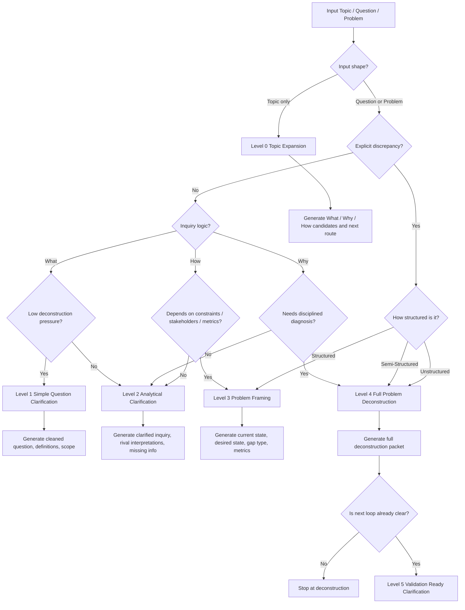

# Question Problem Routing System v3

## Purpose

This document defines a `v3` routing system for `question deconstruction`.

It is based primarily on:

- `perplexity-0-question-forming.md`
- `perplexity-1-problem-deconstruction.md`

It is also constrained by:

- `system-development-principles-canonical.md`

But the canonical principles are `not` themselves the routing path.
They are design constraints on how the router should behave.

So the main question is:

> what kind of deconstruction does this input need, and what is the lightest clarification level that makes it valid, bounded, and actionable?

## Correction Relative To v2

`v2` leaned too much toward development-route families such as truth, structure, product/process, and memory.

That is useful for system work, but it is not the main job of this router.

The main job here is:

- normalize a topic, question, or problem
- classify its inquiry shape
- decide whether it needs simple clarification or full deconstruction
- produce the right clarification packet for the next step

So `v3` recenters the routing system on `question and problem deconstruction`.

## Canonical Design Constraints

The router should follow these principles from `system-development-principles-canonical.md`:

### 1. Use The Smallest Clarification Loop That Matters

Do not force every input into full deconstruction.

The router should choose the lightest level that can:

- make the input valid
- expose the main uncertainty
- define the next useful step

### 2. Define Success Before Escalation

Before routing to deep deconstruction, the router should try to identify:

- what a successful clarification would produce
- what would count as failure or continued ambiguity

### 3. Respect The Source Before Reframing It

The router should preserve the user's native wording first, then reframe.

This means:

- do not normalize too early
- do not silently convert a question into a different question
- make the reframing explicit

### 4. Keep Ambiguity And Failure Legible

If the input is vague, contradictory, or loaded, the router should surface that directly.

It should not pretend the deconstruction is cleaner than the input really is.

### 5. Contain Scope Aggressively

If the input mixes multiple questions or multiple problems:

- split or isolate them before deeper routing

### 6. Preserve The Ability To Kill A Path

The router should make it easy to stop escalation when:

- the question is only factual
- the problem is underspecified beyond safe interpretation
- the expected payoff of deeper deconstruction is too low

### 7. Record Reasoning, Not Just The Route

The output should capture:

- why the route was chosen
- what ambiguity remains
- what next clarification is expected

These are constraints on the router.
They are not route categories.

## Router Goal

The router should classify any input into:

1. `input shape`
2. `question/problem type`
3. `deconstruction need`
4. `clarification level`
5. `next clarification packet`

## Inputs The Router Must Handle

The router should accept three top-level input shapes:

### 1. Topic

A topic is not yet a valid question or problem.

Examples:

- "AI safety"
- "China robotics supply chain"
- "mobile checkout drop"

### 2. Question

A question is mainly an inquiry.

Examples:

- "What is model distillation?"
- "Why did revenue fall after launch?"
- "How should we redesign onboarding?"

### 3. Problem

A problem is a gap, failure, risk, or target-state challenge.

Examples:

- "Retention dropped after the update"
- "We may face compliance risk next quarter"
- "We want to cut latency by half"

## Primary Classification Axes

Every input should be classified across four axes from `perplexity-0-question-forming.md`.

### Axis A: Inquiry Logic

- `What`
  fact, definition, taxonomy, identification
- `Why`
  explanation, cause, diagnosis, interpretation
- `How`
  method, intervention, design, action

### Axis B: Discrepancy Type

- `None`
  no explicit current-vs-desired gap
- `Restorative`
  return to prior or expected state
- `Preventive`
  avoid a future bad state
- `Ideal-Seeking`
  achieve a better state than the current one

### Axis C: Information Structure

- `Structured`
  inputs, goals, and rules are mostly clear
- `Semi-Structured`
  some core pieces are clear, others need judgment
- `Unstructured`
  the problem or question is still highly ambiguous

### Axis D: Cognitive Depth

- `Lower-Order`
  recall, comprehension, basic description
- `Higher-Order`
  analysis, evaluation, design, synthesis

## Secondary Classification Axes

These are routing helpers, not the primary taxonomy.

### Axis E: Deconstruction Pressure

How strongly does this input need disciplined decomposition?

- `Low`
  simple clarification is enough
- `Medium`
  framing is needed before answering
- `High`
  deconstruction is necessary before reasoning or action

### Axis F: Clarification Stakes

- `Low`
  low-cost misunderstanding
- `Medium`
  moderate cost if clarified badly
- `High`
  high-cost error, wrong diagnosis, or mis-scoped effort

## Clarification Levels

The router should route to one of six deconstruction levels.

### Level 0: Topic Expansion

Use when the input is only a topic or broad theme.

Output should produce:

- a cleaned topic statement
- one candidate `What` question
- one candidate `Why` question
- one candidate `How` question
- one initial scope hint
- one recommended next level

Purpose:

- convert a topic into a routable inquiry

### Level 1: Simple Question Clarification

Use when the input is mostly:

- `What`
- `Structured`
- `Lower-Order`
- `Discrepancy = None`
- `Deconstruction Pressure = Low`

Output should produce:

- cleaned question
- key definitions
- scope boundaries
- expected answer form

Purpose:

- clarify, not deconstruct

### Level 2: Analytical Clarification

Use when the input is:

- `Why` or `How`
- or `What` but semi-structured
- often `Higher-Order`
- not yet a full problem frame

Output should produce:

- clarified central question
- rival formulations or interpretations
- scope
- missing information
- what makes the question hard
- recommended next level

Purpose:

- harden the inquiry before full problem framing

### Level 3: Problem Framing

Use when the input already contains a real discrepancy:

- `Restorative`
- `Preventive`
- `Ideal-Seeking`

but still lacks a clean problem statement.

Output should produce:

- current state
- desired state
- gap type
- time horizon
- key affected stakeholders
- draft success criteria
- whether full deconstruction is needed

Purpose:

- turn a vague problem into a valid problem frame

### Level 4: Full Problem Deconstruction

Use when the input is:

- genuinely a problem, not just an inquiry
- `Why` or `How`
- `Semi-Structured` or `Unstructured`
- `Higher-Order`
- or high-stakes enough that shallow clarification is unsafe

Output should use the structure implied by `perplexity-1-problem-deconstruction.md`:

- Preconditions
- Assumptions
- Scope
- Constraints
- Variables
- Root Cause vs Symptom
- Stakeholders
- Objective
- Success Criteria

Purpose:

- produce a disciplined deconstruction packet

### Level 5: Validation-Ready Clarification

Use when the input has already been deconstructed enough that the next step should be a concrete investigation or decision loop.

Output should produce:

- the deconstructed problem statement
- the one uncertainty that matters most next
- the smallest next clarification or validation loop
- what would count as success
- what would count as failure
- what evidence would stop this path

Purpose:

- connect deconstruction to the next real step without overbuilding

## Routing Rules

Apply the routing rules in this order.

### Rule 1: Detect Input Shape

If the input is only a noun phrase, area, or theme:

- route to `Level 0`

If it is already phrased as a question or problem:

- continue

### Rule 2: Check For Explicit Discrepancy

If there is a real current-vs-desired gap:

- route at least to `Level 3`

This is the strongest trigger for problem framing.

### Rule 3: Check Inquiry Logic

If mainly `What`:

- prefer `Level 1`
- escalate to `Level 2` only if ambiguity is real

If mainly `Why`:

- prefer `Level 2`
- escalate to `Level 4` if diagnosis requires assumptions, scope, and causal discipline

If mainly `How`:

- prefer `Level 2`
- escalate to `Level 3` or `Level 4` if action depends on constraints, stakeholders, or success criteria

### Rule 4: Check Information Structure

If `Structured`:

- use the lightest sufficient level

If `Semi-Structured`:

- prefer `Level 2`, `Level 3`, or `Level 4`

If `Unstructured`:

- prefer `Level 4`
- unless the input is still only a topic, then use `Level 0` first

### Rule 5: Check Deconstruction Pressure

If `Low`:

- do not over-escalate

If `Medium`:

- use `Level 2` or `Level 3`

If `High`:

- use `Level 4` or `Level 5`

### Rule 6: Apply Canonical Constraints

Before finalizing the route, verify:

- is this the smallest clarification loop that matters?
- are we preserving the source wording before reframing?
- are ambiguity and failure still visible?
- is scope contained?
- is the next step explicit?

If not:

- step back one level or split the input

## Routing Matrix

| Input Pattern | Typical Route | Why |
| --- | --- | --- |
| Topic only | Level 0 | Not yet routable as a real inquiry |
| What + Structured + Lower-Order + No gap | Level 1 | Simple clarification is enough |
| What + Semi-Structured or Higher-Order | Level 2 | Needs reframing before answer |
| Why + No explicit gap + Semi-Structured | Level 2 | Analytical clarification first |
| Why + Restorative problem | Level 4 | Needs disciplined diagnosis |
| Why + Preventive problem | Level 4 | Needs assumptions, scope, and risk framing |
| How + Structured method question | Level 2 | Method clarification, not full deconstruction |
| How + Ideal-Seeking problem | Level 3 or 4 | Needs target-state framing and constraints |
| Any gap/failure/risk/target problem | Level 3 minimum | Problem frame must be made explicit |
| Unstructured + Higher-Order + High stakes | Level 4 or 5 | Full deconstruction or validation-ready packet needed |

## Deconstruction Emphasis By Question Type

The same full template should not be weighted equally in every case.

### A. Diagnostic Why

Emphasize:

- Preconditions
- Assumptions
- Scope
- Variables
- Root Cause vs Symptom
- Success Criteria

Best for:

- failures
- causal diagnosis
- restorative problems

### B. Intervention How

Emphasize:

- Constraints
- Variables
- Stakeholders
- Objective
- Success Criteria

Best for:

- planning
- design
- implementation
- ideal-seeking problems

### C. Preventive Problem

Emphasize:

- Preconditions
- Assumptions
- Scope
- Constraints
- Stakeholders
- Success Criteria

Best for:

- future risk
- policy response
- resilience planning

### D. Topic Expansion

Emphasize:

- converting the topic into `What`, `Why`, and `How` candidates
- identifying whether a real discrepancy exists
- naming the next useful clarification level

## Router Output Format

For each input, the router should output:

```md
## Routed Intake

- Input shape: Topic | Question | Problem
- Inquiry logic: What | Why | How
- Discrepancy type: None | Restorative | Preventive | Ideal-Seeking
- Structure class: Structured | Semi-Structured | Unstructured
- Cognitive depth: Lower-Order | Higher-Order
- Deconstruction pressure: Low | Medium | High
- Clarification stakes: Low | Medium | High
- Recommended clarification level: 0 | 1 | 2 | 3 | 4 | 5
- Reason for route: ...

## Clarification Output

- Cleaned statement: ...
- Remaining ambiguity: ...
- Required clarification fields: ...
- Expected output after this level: ...
- Suggested next step: ...
```

## Mermaid Diagram



## Practical Use

This router should be used whenever the goal is to understand:

- what the input really asks
- whether it is a question or a problem
- how much deconstruction it actually needs
- what clarification packet should be produced next

The canonical system-development principles matter here only as quality constraints.

They ensure that the router:

- does not over-escalate
- does not hide ambiguity
- does not destroy source meaning
- does not produce vague next steps

## Final Rule

Route by `deconstruction need`, not by abstract development ideology.

Use the lightest clarification level that can:

- preserve the user's real question
- make the inquiry valid and bounded
- expose the real ambiguity
- define the next useful clarification packet

Escalate only when:

- a real discrepancy exists
- causal or action framing requires deeper structure
- the input is under-structured
- the stakes make shallow clarification unsafe

That is the `v3` routing logic.
