## World Action Models are Zero-shot Policies

\( {\text{ Seonghyeon Ye }}^{ \dagger  } \) Yunhao Ge* Kaiyuan Zheng* Shenyuan Gao* Sihyun Yu* George Kurian* Suneel Indupuru* You Liang Tan* Chuning Zhu Jiannan Xiang Ayaan Malik Kyungmin Lee William Liang Nadun Ranawaka Jiasheng Gu Yinzhen Xu Guanzhi Wang Fengyuan Hu Avnish Narayan Johan Bjorck Jing Wang Gwanghyun Kim Dantong Niu Ruijie Zheng Yuqi Xie Jimmy Wu Qi Wang Ryan Julian Danfei Xu Yilun Du Yevgen Chebotar Scott Reed Jan Kautz Yuke Zhu \( {}^{ \dagger  } \) Linxi "Jim" Fan \( {}^{ \dagger  } \) Joel Jang \( {}^{ \dagger  } \)

NVIDIA

\( {}^{ \dagger  } \) Project Leads \( {}^{ * } \) Core Contributors

https://dreamzero0.github.io

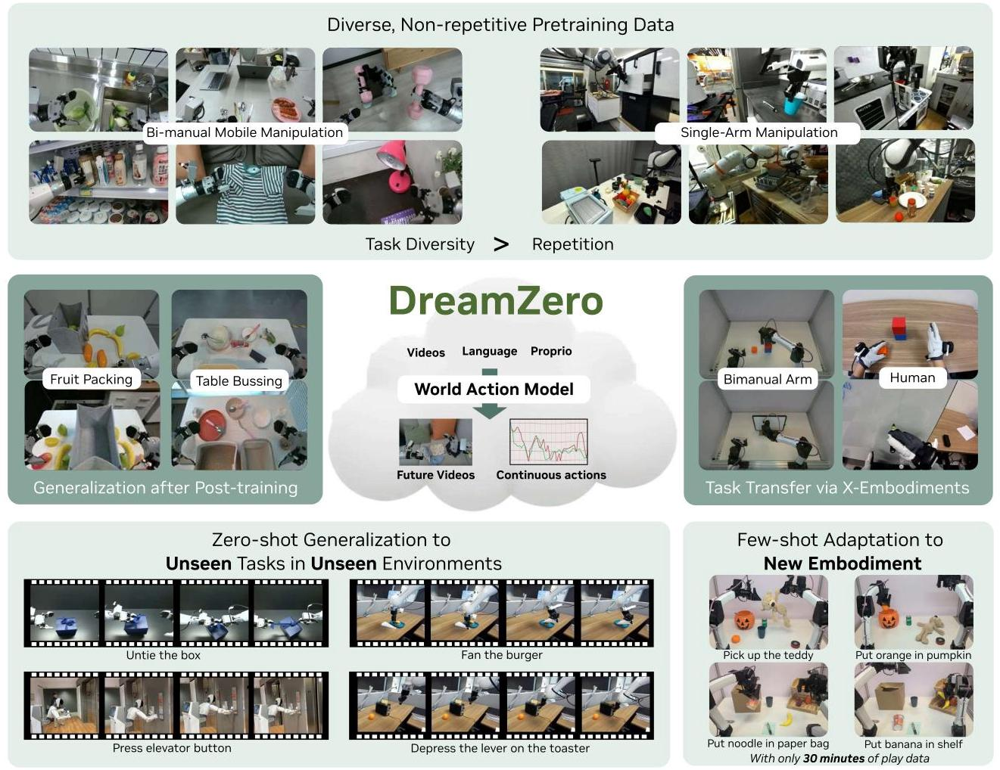

Figure 1: Overview. By jointly predicting video and action, World Action Models (WAMs) inherit world physics priors that enable 1) effective learning from diverse, non-repetitive data, 2) open-world generalization, 3) cross-embodiment learning from video-only data, and 4) few-shot adaptation to new robots.

## Abstract

State-of-the-art Vision-Language-Action (VLA) models excel at semantic generalization but struggle to generalize to unseen physical motions in novel environments. We introduce DREAMZERO, a World Action Model (WAM) built upon a pretrained video diffusion backbone. Unlike VLAs, WAMs learn physical dynamics by predicting future world states and actions, using video as a dense representation of how the world evolves. By jointly modeling video and action, DreamZERO learns diverse skills effectively from heterogeneous robot data without relying on repetitive demonstrations. This results in over \( 2 \times \) improvement in generalization to new tasks and environments compared to state-of-the-art VLAs in real-robot experiments. Crucially, through model and system optimizations, we enable a 14B autoregressive video diffusion model to perform real-time closed-loop control at 7Hz. Finally, we demonstrate two forms of cross-embodiment transfer: video-only demonstrations from other robots or humans yield a relative improvement of over 42% on unseen task performance with just 10-20 minutes of data. More surprisingly, DREAMZERO enables few-shot embodiment adaptation, transferring to a new embodiment with only 30 minutes of play data while retaining zero-shot generalization.

## 1. Introduction

Recent robotic foundation models, termed Vision-Language Action models (VLAs), extend pretrained Vision-Language Models (VLMs) to predict motor actions (Bjorck et al., 2025; Black et al., 2024; Brohan et al., 2023; Gemini Robotics Team, 2025; Kim et al., 2024). While VLAs successfully inherit linguistic priors to generalize across diverse language instructions, especially manipulating diverse objects (Brohan et al., 2023), their generalization to novel environments and, more critically, to new motions or skills remains limited (Guruprasad et al., 2025; Zhou et al., 2025). For example, VLAs can successfully execute "move coke can to Taylor Swift" (Brohan et al., 2023) by leveraging the web knowledge acquired during VLM pretraining to identify the target location, and connecting it to the learned move skill from the robot data. However, they fail at a task like "untie the shoelace" if that specific skill was not present in the robot training data. Although VLM priors encode what to do at a semantic level, they lack representations of how actions should be executed with precise spatial awareness, aligned with geometry, dynamics, and motor control (Chen et al., 2024; Feng et al., 2025). As a result, VLAs often struggle to adapt to new environments or generalize to novel tasks beyond the distribution of expert demonstrations, without explicitly collecting large-scale task- and environment-specific action data.

In this paper, we present DREAMZERo, a 14B robot foundation model built upon a pretrained image-to-video diffusion backbone (Team Wan, 2025). We term this architecture a World Action Model (WAM)—a foundation model designed to predict both actions and visual future states in an aligned manner. Initialized from video diffusion models trained on web-scale video data, WAMs leverage rich spatiotemporal priors to jointly generate future frames and actions conditioned on language instructions and observations. This shifts action learning from dense state-action imitation to inverse dynamics-aligning motor commands with predicted visual futures. Consequently, we observe that this enables (1) effective learning from robot data that are heterogeneous trajectories collected during the execution of useful behaviors in real-world settings, rather than relying solely on carefully repeated demonstrations (2) zero-shot generalization to new tasks in new environments, and (3) efficient cross-embodiment transfer.

This approach yields three core advancements that distinguish DREAMZERO from prior work, including other WAMs (Kim et al., 2026; Liang et al., 2025; Pai et al., 2025). First, DREAMZERO unlocks new generalization capabilities beyond traditional VLAs and previous WAMs-across environments, across tasks, and across embodiments (Figure 2 and Figure 3). Compared to the state-of-the-art pretrained VLAs, we observe more than a \( 2 \times \) improvement in average task progress on environment and task generalization benchmarks. Second, DREAMZERO demonstrates that generalist policies can be learned effectively from diverse, heterogeneous data, breaking away from the conventional wisdom that generalist robot policies require multiple repeated

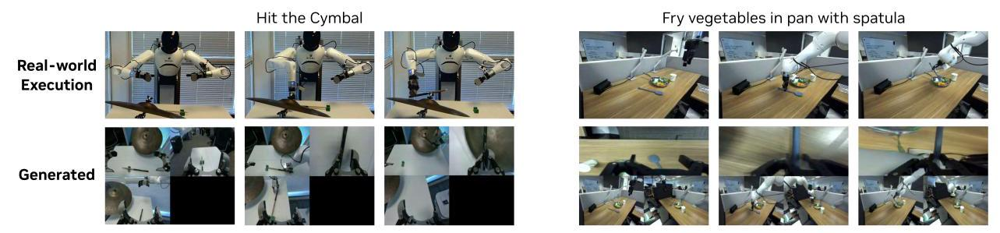

Figure 2: Joint Video and Action Prediction. DREAMZERO jointly generates video and action. We observe that the predicted actions closely align with the generated video. The examples are from totally unseen tasks.

demonstrations per task. Although other WAMs show that priors learned from videos prediction improves sample efficiency for action learning compared to VLAs (Liao et al., 2025; Pai et al., 2025), most works still focus on repeated demonstrations. Moreover, the environment generalization of DreamXEro is retained even after task-specific post-training, outperforming state-of-the-art VLAs by 10% on average task progress. Lastly, we demonstrate two forms of cross-embodiment transfer. First, video-only demonstrations from another robot (YAM) or humans yield a relative improvement of over 42% on unseen task performance for the target robot (AgiBot G1) with just 10-20 minutes of data. Second, and more surprisingly, we show that DreamAZERO enables few-shot embodiment adaptation: a model pretrained on AgiBot G1 adapts to an entirely new robot (YAM) with only 30 minutes of play data, retaining zero-shot generalization. To the best of our knowledge, this sets a new benchmark for data-efficient embodiment adaptation.

DREAMZERO is a 14B autoregressive diffusion transformer trained with a teacher-forcing chunk-wise video denoising objective. Our architectural analysis reveals that larger pretrained video diffusion models produce higher-quality video predictions, which directly translates to superior downstream action execution-indicating that policy performance is fundamentally tied to video generation quality. We further find that diverse distribution of the training data is essential for generalization, outperforming multi-task repetitive data with the same amount of hours. Furthermore, we observe that autoregressive architectures lead to smoother robot motions and higher modality alignment between predicted videos and executed actions.

To address the computational overhead inherent to video diffusion models, we introduce a suite of optimizations spanning three categories: (1) algorithmic improvements, including decoupled video and action denoising schedules (DREAMZERO-Flash); (2) system-level parallelism and caching strategies; and (3) low-level optimizations such as quantization, and CUDA kernel tuning. Collectively, these techniques achieve a \( {38} \times \) inference speedup without degrading performance, enabling DREAMZERO to generate action chunks at approximately \( 7\mathrm{\;{Hz}} \) for smooth, real-time robotic control.

Our main contributions are:

- We introduce DREAMZERO, a 14B WAM that jointly predicts video and actions, enabling effective learning from diverse, non-repetitive robot data.

- We demonstrate over \( 2 \times \) improvement in zero-shot generalization to unseen verbs and motions compared to state-of-the-art VLAs, while retaining generalization across objects and environments.

- We present model and system optimizations achieving \( {38} \times \) inference speedup, enabling real-time closed-loop control at \( 7\mathrm{\;{Hz}} \) .

- We demonstrate cross-embodiment transfer: video-only data from humans (12 minutes) or other robots (20 minutes) yields a relative improvement of over 42% on unseen tasks, and introduce few-shot embodiment adaptation-DREAMZERO pretrained on AgiBot G1 adapts to an entirely new robot (YAM) with only 30 minutes of play data, enabling zero-shot generalization.

- We open-source our model weights, inference code, and code to run publicly available real-world (RoboArena)

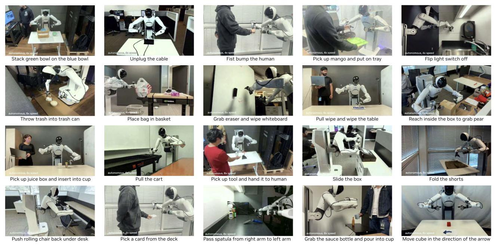

Figure 3: Free-form Evaluation. DREAMZERO performs a diverse range of tasks when conditioned on natural language instructions, including object manipulation, tool use, and human-robot interaction.

and simulation benchmarks (PolaRiS and Genie Sim 3.0) \( {}^{1} \) at https://github.com/dreamzero0/dreamzero.

## 2. Related Work

### 2.1. Vision Language Action Models

Utilizing Foundation Models for Robotics. Developing foundation models (Bommasani et al., 2021) for physical artificial intelligence has emerged as a significant research frontier. One line of work involves using existing, pre-trained foundation models as "black-box" reasoners to handle high-level task planning. These works usually involve modular systems, where the foundation models generate sequences of instructions, visual traces, or affordances that are subsequently executed by specialized, low-level robotic policies or controllers (Brohan et al., 2023; Driess et al., 2023; Huang et al., 2023; Kumar et al., 2026; Singh et al., 2023). While this modularity simplifies complex planning and enables stronger generalization (Kaelbling and Lozano-Pérez; Lee et al., 2025; Li et al., 2025) and efficiency (Dreczkowski et al., 2025), it is contingent upon having a pre-existing library of low-level skills and a robust interface to bridge the gap between abstract reasoning and physical execution. Additionally, these decoupled systems face the risk of compounding errors across modules.

VLAs. On the other hand, end-to-end models such as Vision-Language-Action models (VLAs) (Bjorck et al., 2025; Black et al., 2024; Brohan et al., 2022, 2023; Bu et al., 2025; Gemini Robotics Team, 2025; Kim et al., 2024; Physical Intelligence, 2025; Yang et al., 2025; Ye et al., 2025; Zheng et al., 2025), have gained popularity by moving away from a rigid hierarchy of planning and control, combining language-conditioned semantics and low-level robot actions within the same model. VLAs are often initialized from large vision-language (VLM) models pre-trained on web-scale datasets. While pushing the frontier on visual-semantic knowledge transfer, these models are pre-trained on static image-text datasets, which limits their ability to inherit spatiotemporal priors required to transfer knowledge to new physical skills.

Generalization in VLAs. Generalization in VLAs has been mostly demonstrated on object and semantic level (Brohan et al., 2023; Gao et al., 2025) while generalization to completely new skills and environments has remained limited. In particular, existing work utilizing VLAs achieves environment generalization by collecting human teleoperation data across hundreds of diverse environments for specific tasks (Physical Intelligence, 2025). Furthermore, while current VLAs attempt to achieve task generalization by covering a large library of language-conditioned motion primitives (Gemini Robotics Team, 2025), this approach is fundamentally constrained by the impracticality of capturing the vast amount of possible physical interactions and motions with a fixed set of episode-level language-conditioned tasks. In contrast, video-based world models learn from every consecutive frame pair in the data, while also leveraging large-scale video pretraining to understand physical dynamics.

---

\( {}^{1} \) Despite only being trained on \( \sim  {500} \) hours of real-world data, DREAMZERO shows non-trivial performance on Genie Sim 3.0, which is a simulation benchmark comprised of 100 different tasks without being explicitly trained on the 10k hours of simulation training data.

---

### 2.2. Video Model-based Robot Policies

Video Generation in Robotics. Prior works show that video generation models can be used to synthesize robot trajectories and extract executable actions at test-time through various approaches: inverse-dynamics models (Du et al., 2023; Zhou et al., 2024), optical flow as dense correspondence (Ko et al., 2024), or trajectory prediction as high-level planning (Du et al., 2024; Yang et al., 2024). Other works generate human videos—either with 3D tracking (Liang et al., 2024) or for novel scenes and motions (Bharadhwaj et al., 2024; Chen et al., 2025)—and train policies using point tracking objectives. Most recently, (Jang et al., 2025; Luo et al., 2025) demonstrated that video generation models can produce synthetic robot data for unseen behaviors in novel environments, leveraging the strong generalization capabilities of these models.

Joint Video and Action Generation. Another line of work couples video and action generation for end-to-end learning. These methods demonstrate that incorporating a world modeling objective alongside action prediction improves multi-task performance, sample efficiency, and generalization to novel scenes and objects. Previous work (Cheang et al., 2024; Li et al., 2025; Won et al., 2025; Wu et al., 2024; Zhao et al., 2025; Zheng et al., 2025; Zhu et al., 2025) learns to do joint world modeling and action prediction from scratch or from VLAs, while more recent work (Hu et al., 2024; Kim et al., 2026; Liang et al., 2025; Liao et al., 2025; Pai et al., 2025) leverages pretrained video diffusion models to inherit rich visual dynamics priors. We refer to these models collectively as World Action Models (WAMs) since they leverage world modeling capability (predicting the future state) for action prediction. We use the term World Action Models (WAMs) rather than Video Action Models (VAMs) to reflect that video is just one possible world modeling objective-future WAMs may align actions with other predictive modalities such as tactile sensing, force feedback, or learned latent representations. In contrast to prior WAMs, DreamZEro systematically explores data diversity and scale to expose the full generalization potential of WAMs, adopts an autoregressive architecture better suited for long-horizon world-action modeling, achieves state-of-the-art generalization across both novel tasks and environments, and achieves state-of-the-art cross-embodiment tranfer, both learning from different embodiments (video only) and few-shot adaptation to a new embodiment.

Why WAMs. WAMs built upon video diffusion backbones inherit rich spatiotemporal priors from web-scale data, capturing the best of both paradigms: the seamless gradient flow of end-to-end VLAs and dense world modeling supervision for planning. Unlike latent world models (Assran et al., 2025; Hafner et al., 2019, 2020, 2023), which learn dynamics from scratch in compact latent spaces, WAMs leverage pretrained video representations that already encode physical dynamics from internet-scale data. Central to this approach is learning the joint distribution of video and action—DREAMZERO simultaneously learns both modalities, with video prediction serving as an implicit visual planner that guides action generation. This formulation not only means that improving robotic capabilities reduces to improving video generation, but also enables three capabilities that elude current VLAs: zero-shot generalization to novel tasks, effective learning from heterogeneous robot data, and extremely efficient cross-embodiment transfer from videos. We provide further discussion about the differences between WAMs and alternative world model architectures (e.g., latent-space, 3D point cloud) in Appendix A.

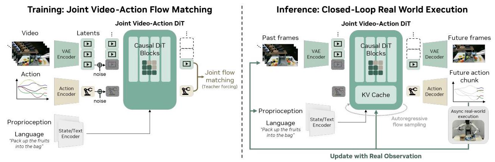

Figure 4: Model Architecture of DREAMZERO. The model takes three inputs: visual context (encoded via a VAE), language instructions (via a text encoder), and proprioceptive state (via a state encoder). These are processed by an autoregressive DiT backbone using flow matching, which jointly predicts future video frames and actions through separate decoders. During training (left), for each chunk, the model denoises noisy video and action latents conditioned on clean video context. During inference (right), predictions are executed asynchronously in the real world, and ground-truth observations are fed back into the KV cache to prevent error accumulation.

## 3. DreamZero

Pretrained video diffusion models offer rich spatiotemporal priors from web-scale data, making them attractive backbones for robot policies. However, converting these models into effective World Action Models (WAMs) presents three key challenges: (1) Video-action alignment: jointly predicting video and actions requires tight coupling between visual futures and motor commands, yet naively combining separate video and action heads can lead to misalignment; (2) Architectural design: it remains unclear whether bidirectional or autoregressive architectures are better suited for WAMs, with implications in modality alignment, error accumulation, and inference efficiency; and (3) Real-time inference: video diffusion models require iterative denoising across high-dimensional latent spaces, making them prohibitively slow for closed-loop control.

DREAMZERO addresses these challenges through three design choices. First, we train a single end-to-end model that jointly denoises video and action with a shared objective, ensuring deep integration between modalities. Second, we adopt an autoregressive architecture and exploit the closed-loop setting: after each action chunk is executed, we replace predicted frames with ground-truth observations in the KV cache, eliminating compounding errors while enabling efficient inference via KV caching and preserving native frame rates for precise modality alignment (See right side of Figure 4). Third, we introduce a suite of system-, implementation-, and model-level optimizations that achieve a \( {38} \times \) inference speedup, enabling real-time control at 7Hz. We detail the model architecture in Section 3.1 and real-time execution in Section 3.2.

### 3.1. Model Architecture

Problem Formulation. DreamAZERO jointly predicts video \( {\mathbf{o}}_{l : l + H} \) and actions \( {\mathbf{a}}_{l : l + H} \) conditioned on language instruction \( \mathbf{c} \) , proprioceptive state \( {\mathbf{q}}_{l} \) and visual observation including the current and the past history \( {\mathbf{o}}_{0 : l} \) where \( H > 0 \) is a fixed horizon and \( l \) is a random index sampled from a trajectory. Note that joint prediction of video and action is a decomposition of (1) autoregressive video prediction and (2) action prediction from an inverse-dynamics model (IDM):

\[
\underset{\text{ DEAMZERO }}{\underbrace{{\pi }_{0}\left( {{\mathbf{o}}_{l : l + H},{\mathbf{a}}_{l : l + H} \mid  {\mathbf{o}}_{0 : l},\mathbf{c},{\mathbf{q}}_{l}}\right) }} = \underset{\text{ video prediction }}{\underbrace{{\pi }_{0}\left( {{\mathbf{o}}_{l : l + H} \mid  {\mathbf{o}}_{0 : l},\mathbf{c},{\mathbf{q}}_{l}}\right) }}\underset{\text{ IDM }}{\underbrace{{\pi }_{0}\left( {{\mathbf{a}}_{l : l + H} \mid  {\mathbf{o}}_{0 : l + H},{\mathbf{q}}_{l}}\right) }} \tag{1}
\]

Instead of using two separate models (video prediction model and inverse dynamics model) to model the decomposed objective (Li et al., 2026; Pai et al., 2025), we train a single model end-to-end with joint prediction objective. We believe that this end-to-end design enables better video-action alignment through a deep integration between the two modalities. Since pretrained video models are already optimized on the video prediction objective on diverse web-scale video data, DREAMZERO only needs to additionally learn to predict videos for the robot embodiment videos and extract corresponding actions from the generated videos. We further hypothesize that this encourages better generalization than the conventional practice of training VLA from VLM, as our approach explicitly learns temporal dynamics from video frames used both as conditioning inputs and prediction targets.

Model Architecture. The model architecture is shown in Figure 4. To retain the generalization capability of video models, we introduce minimal additional parameters: state encoders, action encoders, and decoders. For robot training data that contains multiple views, we concatenate all views into a single frame instead of making architectural changes to the backbone model.

In particular, DREAMZERO is trained to predict video frames and corresponding actions autoregressively. Autoregressive generation possesses the following advantages: (1) it enables faster inference speed by utilizing KV-cache, (2) the policy model can leverage the visual observation history as guidance for the next generation, and (3) it avoids the modality alignment challenges (video, action, and language alignment) inherent to bidirectional models. Concretely, bidirectional diffusion typically requires processing fixed-length sequences, which often necessitates video subsampling that distorts native FPS, potentially harming video-action alignment. On the other hand, autoregressive generation leverages KV caching to support arbitrarily long contexts within a single forward pass. This preserves the native frame rate, ensuring precise alignment between video frames and robot actions. Some details illustration of this difference is provided in Appendix B.

We introduce autoregressive modeling only for the video modality to avoid error propagation coming from closed-loop action prediction. DREAMZERO is trained to predict video frames in a chunk manner; each chunk has a fixed number of latent frames \( K \) to match the action horizon. Chunk-wise generation enables training on variable length of videos, similar to how LLMs are trained on variable length of language tokens. We provide more details on the QKV attention masking strategy for the different modalities in Appendix C.

Training Objective. Similar to recent video diffusion models and VLAs, we employ flow-matching (Albergo et al., 2023; Lipman et al., 2022; Liu et al., 2022) as the training objective (Ali et al., 2025; Team Wan, 2025; Teng et al., 2025). Unlike recent WAMs (Kim et al., 2026; Li et al., 2025; Liao et al., 2025; Zhu et al., 2025), DREAMZERO shares the denoising timestep between video and action modality for faster convergence at the beginning of training. Also, we apply teacher forcing (Gao et al., 2024; Jin et al., 2024) as a training objective; the model is trained to denoise the noisy current chunk conditioned on the clean previous chunks.

Formally, given a chunk index \( k > 0 \) and the denoising timestep \( {t}_{k} \in  \left\lbrack  {0,1}\right\rbrack \) , we denote the corresponding noisy video latent vector for original video \( {\mathbf{o}}^{k} \) as \( {\mathbf{z}}_{{t}_{k}}^{k} \) and noisy normalized actions as \( {\mathbf{a}}_{{t}_{k}}^{k} \) . All frames within the same chunk share the same timestep \( {t}_{k} \) , while different chunks are assigned independent timesteps. Our model denoises \( {\mathbf{z}}_{{t}_{k}}^{k} \) and \( {\mathbf{a}}_{{t}_{k}}^{k} \) , defined as linear interpolations between clean vectors and random Gaussian noises:

\[
{\mathbf{z}}_{{t}_{k}}^{k} = {t}_{k}{\mathbf{z}}_{1}^{k} + \left( {1 - {t}_{k}}\right) {\mathbf{z}}_{0}^{k},\;{\mathbf{a}}_{{t}_{k}}^{k} = {t}_{k}{\mathbf{a}}_{1}^{k} + \left( {1 - {t}_{k}}\right) {\mathbf{a}}_{0}^{k}, \tag{2}
\]

where \( {\mathbf{z}}_{0}^{k} \sim  \mathcal{N}\left( {\mathbf{0},\mathbf{I}}\right) ,{\mathbf{a}}_{0}^{k} \sim  \mathcal{N}\left( {\mathbf{0},\mathbf{I}}\right) \) , and \( {\mathbf{z}}_{1}^{k} \) and \( {\mathbf{a}}_{1}^{k} \) are a clean video latent vector and a normalized action, respectively. Thus, the clean context from the previous chunks can be denoted as \( {\mathcal{C}}_{k} = {\left\{  \left( {\mathbf{z}}_{1}^{j},{\mathbf{a}}_{1}^{j}\right) \right\}  }_{j = 1}^{k - 1} \) .

We train the model \( {\mathbf{u}}_{\theta } \) to predict the joint velocity for both modalities using the following flow-matching objective:

\[
\mathcal{L}\left( \theta \right)  = {\mathbb{E}}_{\mathbf{z},\mathbf{a},\left\{  {t}_{k}\right\}  }\left\lbrack  {\frac{1}{K}\mathop{\sum }\limits_{{k = 1}}^{K}w\left( {t}_{k}\right) {\begin{Vmatrix}{\mathbf{u}}_{\theta }\left( \left\lbrack  {\mathbf{z}}_{{t}_{k}}^{k},{\mathbf{a}}_{{t}_{k}}^{k}\right\rbrack  ;{\mathcal{C}}_{k},\mathbf{c},{\mathbf{q}}_{k},{t}_{k}\right)  - {\mathbf{v}}^{k}\end{Vmatrix}}^{2}}\right\rbrack  , \tag{3}
\]

where \( w\left( {t}_{k}\right)  > 0 \) is a predefined weight function for \( {t}_{k},\mathbf{c} \) is the text condition, \( {\mathbf{q}}_{k} \) is the proprioceptive states of \( k \) -th chunk, and the velocity \( {\mathbf{v}}^{k} \mathrel{\text{ := }} \left\lbrack  {{\mathbf{z}}_{1}^{k},{\mathbf{a}}_{1}^{k}}\right\rbrack   - \left\lbrack  {{\mathbf{z}}_{0}^{k},{\mathbf{a}}_{0}^{k}}\right\rbrack \) . To enable efficient training, we perform trajectory-level updates and apply attention masking (e.g., see Figure 14 for details) so that the current noisy chunk can attend to clean context of previous chunks. We provide the pseudo-code in Algorithm 1.

Model Inference. As shown in Figure 4, during inference, DREAMZERO jointly denoises video and action chunks, leveraging KV caching for efficiency (Huang et al., 2025; Teng et al., 2025; Yin et al., 2025). Unlike pure video generation, our closed-loop setting allows ground-truth observations to replace generated frames in the KV cache after each action execution (see Figure 14). This eliminates the compounding error problem inherent to autoregressive video generation-a key advantage unique to WAMs. Moreover, as a stateful policy, DREAMZERO can leverage visual history for tasks requiring memory. \( {}^{2} \) . We provide the pseudo-code of inference in Algorithm 2

### 3.2. Real-time Execution of DreamZero

Diffusion-based WAMs inherit powerful generalization from video foundation models, but their iterative denoising process creates a fundamental tension with reactive robotic control. We address two questions: (1) What prevents WAMs from being reactive policies? (2) How do we resolve this for real-time control?

##### 3.2.1.The Reactivity Gap

Reactive policies must respond to environmental changes within tens of milliseconds. A naive implementation of DreamZero on a single GPU requires approximately 5.7 seconds per action chunk due to three bottlenecks: (1) iterative denoising across 16 diffusion steps required for smooth actions, (2) the computational cost of a 14B parameter DiT backbone, and (3) sequential execution that blocks robot motion during inference. This latency makes closed-loop control infeasible. \( {}^{3} \)

#### 3.2.2. Asynchronous Closed-Loop Execution

Our first step towards resolving this is through asynchronous execution that decouples inference from action execution. Rather than waiting for each inference to complete, the motion controller continuously executes the most recent action chunk while inference runs concurrently on the latest observation. This structure transforms the latency constraint from "inference must complete before the robot moves" to "inference must complete before the current action chunk expires." In our experiments, we deploy policies at an action horizon of 48 steps at \( {30}\mathrm{\;{Hz}} \) control frequency (1.6 seconds per chunk) for bimanual manipulation robots. Hence, we target inference latency below approximately \( {200}\mathrm{\;{ms}} \) to ensure sufficient overlap for smooth, reactive control.

#### 3.2.3. System-level Optimizations

Given the asynchronous execution structure, we optimize inference throughput through parallelism and caching.

- CFG Parallelism. Classifier-free guidance (Ho and Salimans, 2022) requires two forward passes (condi tional and unconditional). We distribute these across two GPUs, reducing per-step latency by 47%.

- DiT Caching. We exploit the directional consistency of velocity predictions during flow matching. When cosine similarity between successive velocities exceeds a threshold, we reuse cached velocities, reducing effective DiT steps from 16 to 4 with minimal quality loss on action prediction.

#### 3.2.4. Implementation-level Optimizations

We further reduce latency through compiler and kernel enhancements.

---

\( {}^{2} \) In this work, we do not explicitly evaluate or post-train DREAMZERO on tasks that can only succeed with memory. We leave this for future work.

\( {}^{3} \) One might expect that generating only actions (not video) would accelerate inference, but at 14B scale we empirically found out that the speed gain is minimal-the number of diffusion steps and the number of DiT blocks dominate latency. Moreover, because video and action are jointly trained for strong cross-modal alignment, naively reducing action denoising steps degrades quality. This motivates DREAMZERO-Flash.

---

- Torch Compile and CUDA Graphs. We apply torch.compile with CUDA Graphs to eliminate CPU overhead and fuse operators. Static shapes cause recompilations only during the first trajectory.

- Post-Training Quantization. On Blackwell architecture, we quantize weights and activations to NVFP4 while keeping sensitive operations (QKV, Softmax) in FP8 and non-linear operations in FP16.

- Kernel and Scheduler Enhancements. We use the cuDNN backend for attention and migrate scheduler operations to GPU to eliminate CPU-GPU synchronization stalls.

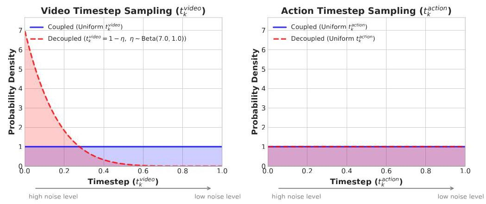

Figure 5: Decoupled Noise Schedules. DREAMZERO (blue) uses coupled noise for video and action (both uniform). DREAMZERO-Flash (red) biases video toward high-noise states via a Beta distribution while keeping action noise uniform, training the model to predict clean actions from noisy visual context.

#### 3.2.5. Model-level Optimizations: DreamZero-Flash

Even with system optimizations, the number of diffusion steps remains the primary latency bottleneck. However, naively reducing steps degrades action quality because residual visual noise propagates into action predictions.

DREAMZERO-Flash addresses this by decoupling video and action noise schedules during training. The key insight is that, at inference time, actions should denoise to their final values while being conditioned on a still-noisy video representation within the current chunk, since with very few denoising steps (e.g., fewer than 4), the generated video tokens may remain inaccurate and thus provide a noisy conditioning signal. Standard DREAMZERO samples a shared timestep \( {t}_{k} \sim  \mathcal{U}\left( {0,1}\right) \) for both modalities. This creates a train-test mismatch: during training, the model learns to predict actions when video and action are at the same noise level, but few-step or single-step inference requires predicting clean actions while video remains partially noisy.

DREAMZERO-Flash closes this gap by biasing video timesteps toward high-noise states via \( {t}_{k}^{\text{ video }} = 1 - \eta \) , where \( \eta  \sim  \operatorname{Beta}\left( {\alpha ,\beta }\right) \) with \( \alpha  > \beta \) . In practice, we use \( \operatorname{Beta}\left( {7,1}\right) \) as an example configuration, yielding \( \mathbb{E}\left\lbrack  {t}_{k}^{\text{ video }}\right\rbrack   = {0.125} \) (predominantly noisy), while action timesteps remain uniform (Figure 5). During training, this exposes the model to configurations where it must predict clean actions from noisy visual context, directly matching the few-step or single-step inference regime. As a result, we reduce the diffusion steps from four to one, cutting inference from \( \sim  {350}\mathrm{\;{ms}} \) to \( \sim  {150}\mathrm{\;{ms}} \) with minimal performance loss (Table 3). Moreover, the Flash formulation enables flexible training configurations-such as varying the noise sampling ratios of video and action-to better align training with different few-step or single-step inference regimes. In practice, we mainly apply Flash training as the final stage following the main DREAMZERO model training.

Action Chunk Smoothing. To suppress high-frequency noise in generated actions, we upsample chunks to \( 2 \times \) resolution, apply a Savitzky-Golay filter, and downsample to original resolution.

#### 3.2.6. Summary

Table 1 summarizes cumulative speedups. System and implementation optimizations yield \( \sim  9 \times \) speedup on H100 and \( \sim  {16} \times \) on GB200; adding DreamZERo-Flash achieves \( {38} \times \) on GB200, reducing latency from 5.7s to

150ms. With the exception of DiT caching and quantization, all system and implementation-level optimizations are mathematically equivalent to baseline and show no measurable performance degradation.

<table><tr><td>Optimization</td><td>H100</td><td>GB200</td></tr><tr><td>Baseline</td><td>1×</td><td>\( {1.1} \times \)</td></tr><tr><td colspan="3">System-level</td></tr><tr><td>+ CFG Parallelism</td><td>1.9×</td><td>1.8×</td></tr><tr><td>+ DiT Caching</td><td>5.5×</td><td>5.4×</td></tr><tr><td colspan="3">Implementation-level</td></tr><tr><td>+ Torch Compile + CUDA Graphs</td><td>8.9×</td><td>10.9×</td></tr><tr><td>+ Kernel & Scheduler Opts.</td><td>9.6×</td><td>14.8×</td></tr><tr><td>+ Quantization (NVFP4)</td><td>-</td><td>16.6×</td></tr><tr><td colspan="3">Model-level</td></tr><tr><td>+ DREAMZERO-Flash</td><td>-</td><td>\( {38} \times \)</td></tr></table>

Table 1: Cumulative inference speedups. Each row includes all optimizations above it. Entries marked "_" indicate features not applicable to that hardware.

## 4. Experimental Setup

We validate our main hypotheses about learning from diverse data on two robot embodiments: the AgiBot G1 mobile bimanual manipulator and the Franka single-arm robot. We pretrain separately for each embodiment, leaving multi-embodiment training for future work. For cross-embodiment experiments, we utilize both the YAM robot and human egocentric data. The experimental setup for AgiBot G1 is illustrated in Figure 7.

We compare against two state-of-the-art Vision-Language-Action models (VLAs): GR00T N1.6 (Bjorck et al., 2025) and \( {\pi }_{0.5} \) (Physical Intelligence,2025). For each baseline, we evaluate two initialization strategies: (1) from-scratch, using pretrained VLM weights without prior robot data training for a fair apple-to-apple comparison with DREAMZERO, and (2) from-pretrained, using official checkpoints pretrained on thousands of hours of cross-embodiment robot data. Both variants are then trained on identical data as DREAMZERO: \( \sim  {500} \) hours of teleoperation data we collected for AgiBot G1, and DROID (Khazatsky et al., 2024) for Franka. We keep the compute budget comparable across all methods by matching total batch size and gradient steps. \( {}^{4} \)

### 4.1. Pretraining

Data. Our data collection philosophy differs from that of existing VLAs. While recent works have shown that VLAs can learn effective policies from moderate-sized datasets, these approaches typically rely on structured, task-focused demonstrations to ensure consistent behavior. We hypothesize that learning to only predict actions without encoding the knowledge about future world states makes it challenging to leverage highly heterogeneous, non-repetitive data effectively, as the model must implicitly infer dynamics from noisy state-action pairs. In contrast, we hypothesize DREAMZERO's world modeling objective enables effective learning from diverse demonstrations, allowing us to prioritize breadth and utility over repetition during data collection.

Using AgiBot G1, we collect approximately 500 hours of teleoperation data across 22 unique environments (see Figure 15), including homes, restaurants, supermarkets, coffee shops, and offices—prioritizing task diversity and real-world utility over task-specific repetition. As shown in Figure 6, each episode averages around 4.4 minutes and encompasses approximately 42 subtasks—significantly longer-horizon than typical robotic manipulation datasets (Khazatsky et al., 2024; Walke et al., 2023). The skill distribution reflects real-world deployment requirements: navigation enables movement between workspaces, while torso adjustments allow

---

\( {}^{4} \) For from-pretrained baselines, this constitutes continual training on top of the official weights.

---

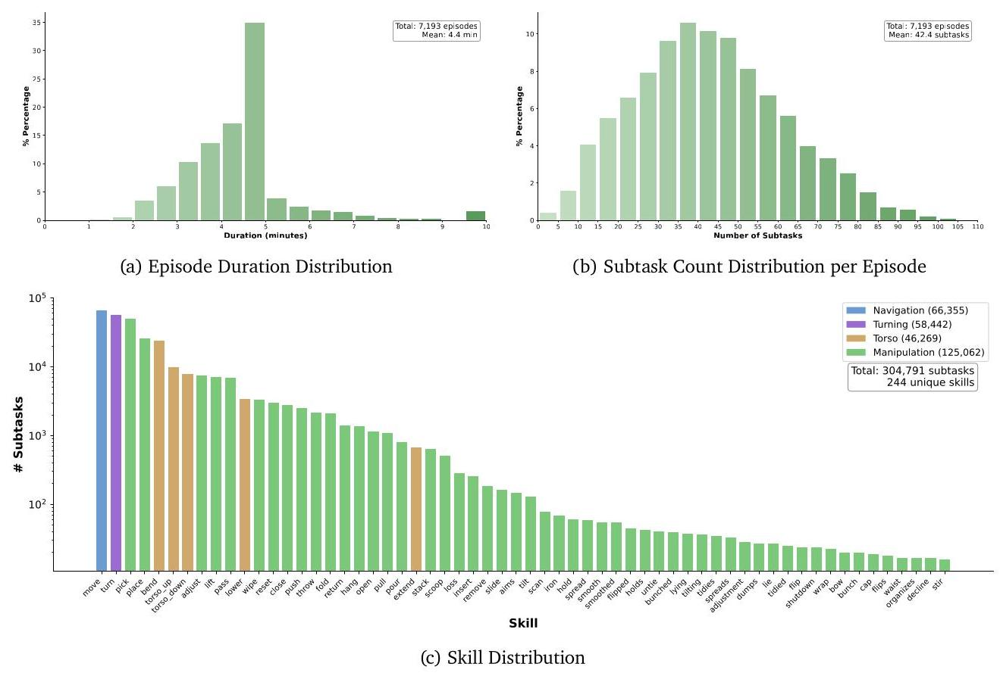

Figure 6: Distribution statistics for the AgiBot pretraining corpus: episode durations, subtask density, and skill coverage across 7.2K episodes (~500 hours).

interaction with objects at varying heights (shelves, cabinets). Additional details on the data collection pipeline are provided in Appendix E. \( {}^{5} \)

We also validate DREAMZERO on the Franka single-arm robot using DROID (Khazatsky et al., 2024), one of the most heterogeneous publicly available robotic datasets to demonstrate the effectiveness of WAMs on diverse, open-source data and enables reproducibility prior to the release of our in-house AgiBot dataset. We open-source the checkpoint and inference code to run some DROID-sim evals in PolaRiS (Jain et al., 2025). \( {}^{6} \)

Training. We use Wan2.1-I2V-14B-480P (Team Wan, 2025), a 14B image-to-video diffusion model, as the backbone for DREAMZERO. We train for 100K steps with a global batch size of 128 for AgiBot and 100K steps with a global batch size of 128 for DROID datasets. We update all DiT blocks, the state encoder, action encoder, and action decoder, while freezing the text encoder, image encoder, and VAE. \( {}^{7} \) For both datasets, we filter out idle actions and use relative joint positions as the default action representation. We also conduct some ablations (Section 5.2) where we initialize from Wan2.1-I2V-5B-480P to see the effect of model size (5B vs. 14B).

Evaluation Protocol. We evaluate models out of the box after pretraining. Our default evaluation setting is unseen environments, unseen objects-because our pretraining and post-training data were collected in a different geographic location from our evaluation sites, every benchmark inherently tests out-of-distribution generalization rather than interpolation within the training distribution. We evaluate on two categories: seen and unseen tasks. We define the granularity of a task as a combination of the motion required for the task and the object type. For example, if the training data contains folding a red-colored shirt and evaluate the model to fold a black-colored shirt with a different size, it is considered as a seen task. On the other hand, if we evaluate the model to fold socks, it is considered as an unseen task because the motion required to fold socks is different from folding a shirt (See samples in Figure 7).

---

\( {}^{5} \) We plan to open-source this dataset in upcoming releases. Some samples can be found at https://dreamzero0.github.io/training_ data_gallery

\( {}^{6} \) Available at https://github.com/dreamzero0/dreamzero.

\( {}^{7} \) We experimented with LoRA (Hu et al.,2022) but found it led to suboptimal results.

---

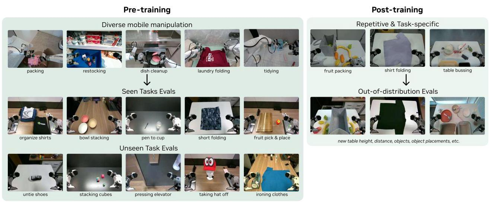

Figure 7: AgiBot Evaluation Set-up. We are first-citizens of generalization evals, where the default setting is unseen environment and unseen objects.

AgiBot Evaluation Protocol. For seen tasks, we select 10 tasks from the pretraining distribution, including pick-and-place variants, stacking, wiping, and folding; we run 8 rollouts per task across 4 robots, each in different environments and different objects (80 rollouts total per checkpoint). We divide 10 seen tasks into three categories: PnP-Easy (Pick and place fruit, Wipe the mess, Take out fruit from bag), PnP-Hard (Pick and place fork/spoon, put the pen in pen holder, put the cup on the coaster, stack bowls/cups in a row), and Contact-Rich Manipulation (fold shirts, fold shorts, stack clothes). For unseen tasks, we evaluate 10 tasks absent from training-such as ironing, painting, pulling carts, cube stacking, removing a hat from a mannequin, and untying shoe laces-with 8 rollouts per task across 4 robots (80 rollouts total per checkpoint). The full list of each evaluation rollout initial frame and prompt is provided in Appendix F, and some evaluation rollouts can be found here. \( {}^{8} \)

DROID Evaluation Protocol. We evaluate on 20 seen tasks and 20 unseen tasks (verbs absent from DROID), performing 2 rollouts per task, for a total of 80 evaluation rollouts across 40 tasks for each checkpoint. We compare DREAMZERO against the publicly released \( {\pi }_{0.5} \) -DROID and an internally trained GR00T N1.6-DROID checkpoint. Object positions are fixed across checkpoints to ensure fairness. Each rollout is scored from 0 to 1.0 based on partial task completion; full details are provided in Appendix G.

### 4.2. Post-training

Beyond pre-training, we evaluate whether WAMs improve fine-tuning performance on task-specific data using the AgiBot robot.

Data. We collect post-training data on three downstream tasks:

- Shirt folding (33 hrs): Fold a flattened t-shirt through 5 sequential stages. We randomize initial shirt position across 2 shirt types.

---

\( {}^{8} \) https://dreamzero0.github.io for main evaluation rollouts and https://dreamzero0.github.io/evals_gallery for accumulation of unique evaluation rollouts.

---

- Fruit packing (12 hrs): Pack 10 fruits from a table into a bag. We randomize fruit combinations and positions of fruits and bag.

- Table bussing (40 hrs): Clear 5 pieces of trash into a trash bin and 5 pieces of dishware (dish, bowl, fork, and spoon) into a dish bin. We randomize object types, combinations, and positions.

Training. We post-train for 50K steps per task. As in pretraining, we update all parameters except the text encoder, image encoder, and VAE.

Evaluation Protocol. We measure average task progress across 10 rollouts per task. Task progress is defined as: (1) folding stages completed out of 5 for shirt folding, (2) fruits successfully packed out of 10 for fruit packing and (3) items cleared for table bussing. Following Barreiros et al. (2025), we apply an image overlay to the initial scene to reduce variance.

## 5. Experimental Results

### 5.1. Main Results

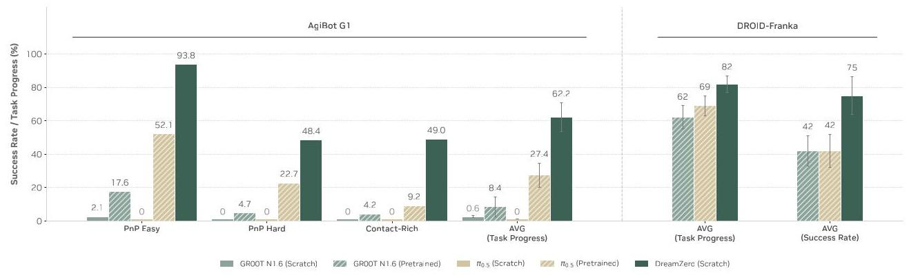

Figure 8: Seen Task Evaluation. DREAMZERO effectively learns from diverse data and generalizes to new environments, outperforming VLAs across all task categories. VLAs trained from scratch achieve near-zero success, while pretrained VLAs show modest performance-likely benefiting from embodiment-specific knowledge acquired through repetitive demonstrations during pretraining.

We evaluate the zero-shot generalization performance of DreamXEro compared to baseline models and investigate the following research questions:

### Q1.Do WAMs learn better from diverse, non-repetitive data?

We evaluate pretrained models out-of-the-box on tasks present in the pretraining data, but in zero-shot environments with unseen objects. Results are shown in Figure 8.

On AgiBot G1, from-scratch VLAs achieve near-zero task progress score across all categories. Even on simple pick-and-place tasks (PnP Easy), VLAs occasionally reach toward the correct object but fail to interact accurately with unseen objects in novel environments. In contrast, DreamZero successfully learns from heterogeneous data, achieving 62.2% average task progress-over \( 2 \times \) higher than the best pretrained VLA baseline (27.4%), despite those baselines being pretrained on thousands of hours of cross-embodiment robot data before continued training on our data mix. On DROID-Franka, we show a similar result as well; DreamXEro which is only trained on the DROID dataset outperforms pre-trained baseline models trained on multiple robot embodiment data.

We attribute this gap to the joint video-action formulation: while VLAs require massive robot data to learn direct observation-to-a ction mappings, WAMs leverage video generation as a strong prior for action prediction, enabling effective learning of diverse data and generalization to unseen environments. Notably, we observe tight alignment between generated videos and real-world execution, even for suboptimal behaviors (Figure 16). Most DREAMZERO failures stem from video generation errors rather than action prediction-the policy faithfully executes whatever trajectory the video predicts. This suggests that improvements to the video backbone would directly translate to better WAM performance.

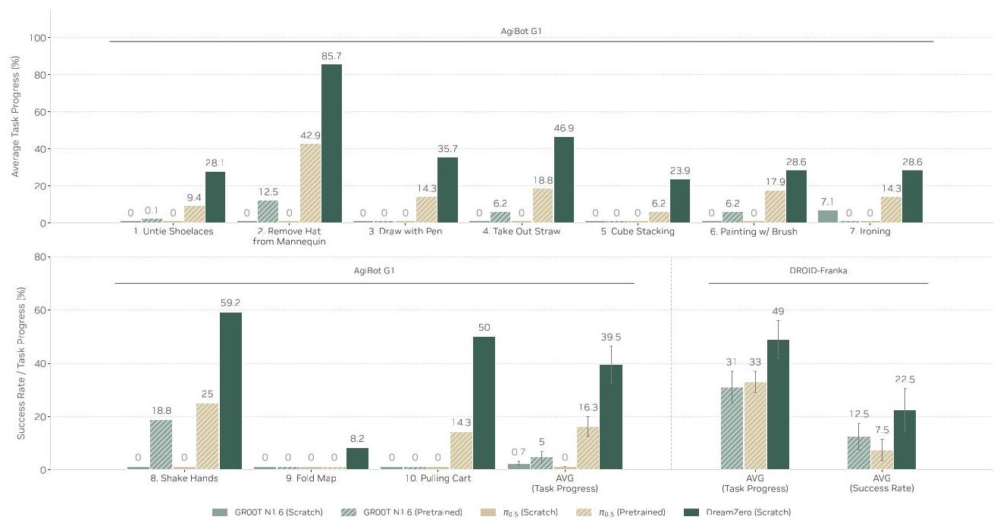

Figure 9: Zero-shot Generalization to Unseen Tasks. DREAMZERO achieves non-trivial task progress on 10 tasks absent from training, while VLAs struggle across both embodiments.

### Q2.Do WAMs generalize to unseen tasks?

Figure 9 evaluates generalization to 10 tasks entirely absent from the pretraining distribution, including untying shoelaces, ironing, painting with a brush, and shaking hands.

On AgiBot G1, from-scratch VLAs achieve near-zero task progress (< 1%), while DreamZero reaches 39.5% on average-with strong performance on tasks like "Remove Hat from Mannequin" (85.7%) and "Shake Hands" (59.2%). DreamZERO also significantly outperforms pretrained VLA baselines (39.5% vs. 16.3%), even though those baselines may have encountered some of these tasks during cross-embodiment pretraining. Also on the DROID-Franka setup, DREAMZERO significantly outperforms (49% task progress, 22.5% success rate) other pretrained baselines (31% task progress, 12.5% success rate for GR00T N1.6 and 33% task progress, 7.5% success rate for \( {\pi }_{0.5} \) ).

Qualitatively, we observe that pretrained VLAs often reach toward objects and attempt grasping regardless of the instruction, suggesting they overfit to dominant training behaviors (e.g., pick-and-place) rather than understanding novel task semantics, accounting for their partial task progress despite failing to complete the intended tasks. In contrast, DREAMZERO performs visual planning for unseen tasks and executes them successfully, with strong alignment between generated videos and real-world actions.

Beyond structured evaluation, we conduct free-form testing on over 100+ additional tasks, including "Pop the ballon" and "Press elevator button", by doing free-form prompting with verbal instructions. \( {}^{9} \)

---

\( {}^{9} \) Rollouts of these tasks are provided in https://dreamzero0.github.io/evals_gallery/.

---

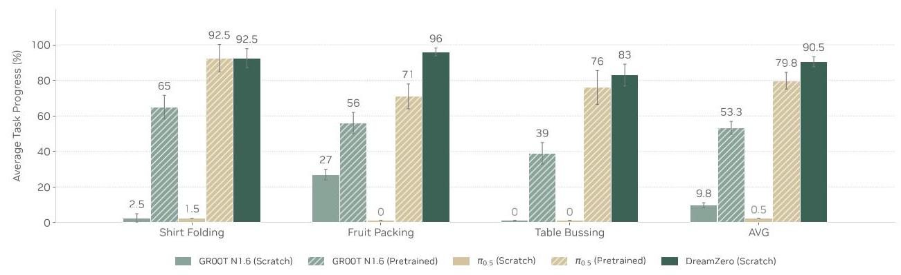

Figure 10: Posttraining Results. WAMs enable stronger post-training results across three tasks, indicating that environment generalization of DREAMZERO is retained after post-training.

### Q3.Do WAMs improve post-training performance?

We investigate whether WAMs retain their generalization even after fine-tuning on task-specific data. Figure 10 shows results on three tasks with varying distribution diversity.

DREAMZERO matches or outperforms VLA baselines across all tasks: comparable performance on shirt folding and table bussing while significantly outperforming on fruit packing. Similar to the findings from Figure 8 and Figure 9, from-scratch baselines fail to learn accurate motions to grasp the target objects; this means that from-scratch VLAs tend to overfit to the training data and fail to generalize to scenarios where we vary the table height, table distance, objects, and object placements, mostly due to the evaluation site being in a different geographic location (see Figure 7 for samples). Although pretraining on multiple robot embodiments with repetitive data largely boosts the post-training genearlization performance for pretrained baselines, DREAMZERO still matches or outperforms pretrained VLA baselines without cross embodiment pretraining. Since we still evaluate on unseen environments for post-training, this implies that the environment generalization of DreamXZero is retained after post-training.

### Q4.Do WAMs enable strong cross-embodiment transfer to unseen tasks?

Having shown that WAMs generalize to unseen tasks (Figure 9), we now investigate whether this generalization can be further improved by leveraging video data from different embodiments performing the same tasks. Crucially, we use only the video prediction objective for the cross-embodiment data (no actions), while maintaining the joint video-action objective for the AgiBot pretraining data; the cross-embodiment data thus serves as additional visual experience to strengthen the world model's understanding of task dynamics and expected behavior.

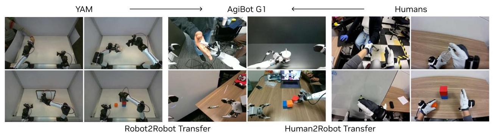

Figure 11: Cross-Embodiment Transfer. We explore robot-to-robot (YAM \( \rightarrow \) AgiBot) and human-to-robot embodiment transfer to unseen tasks.

We explore two settings (Figure 11): (1) Robot-to-robot transfer using the bimanual YAM robot, and (2) Human-to-robot transfer using egocentric human demonstrations. For each setting, we collect 72 multi-view trajectories of the 9 unseen tasks (8 demonstrations per task, 20 minutes for YAM, 12 minutes for human). \( {}^{10} \) We then co-train from the DreamAZero-AgiBot checkpoint on a 1:1 mix with pretraining data for 10K steps.

Results on the 9 unseen tasks (Table 2) show that both transfer settings improve performance over the baseline DREAMZERO. Robot-to-robot transfer yields the largest gain (38.3% → 55.4%), likely due to the narrower embodiment gap; both YAM and AgiBot are bimanual parallel grippers. Human-to-robot transfer also improves performance (38.3% → 54.3%), despite the larger morphological gap and dynamic egocentric viewpoints.

<table><tr><td>Method</td><td>Task Progress</td></tr><tr><td>DREAMZERO</td><td>38.3% ± 7.6%</td></tr><tr><td>DREAMZERO + Human2Robot Transfer</td><td>54.3% ± 10.4%</td></tr><tr><td>DREAMZERO + Robot2Robot Transfer</td><td>55.4% ± 9.5%</td></tr></table>

Table 2: Cross-Embodiment Transfer Results. Average task progress on unseen tasks ( \( \pm \) standard error). Both transfer settings improve over baseline (result from Table 9) using only 10-20 minutes of video-only demonstration data.

These results point to a promising property of WAMs: unlike recent VLA approaches to embodiment transfer (Ka-reer et al., 2025; Team, 2025), our method relies solely on visual information without action labels. While current success rates remain moderate, the consistent improvement from just 10-20 minutes of video-only data provides an early signal that cross-embodiment visual experience transfers meaningfully. This opens a potential scaling pathway: abundant human video data-orders of magnitude larger than robot datasets-could enable WAMs to acquire diverse skills without action annotation, pending further research into strengthening the transfer mechanism.

Q5. Do WAMs enable few-shot new embodiment adaptation?

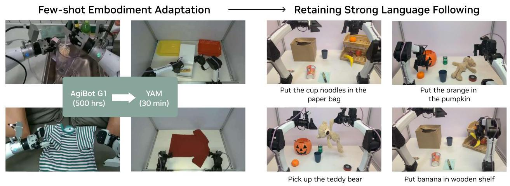

Figure 12: Few-shot Embodiment Adaptation. We explore few-shot embodiment adaptation by post-training on 30 minutes of new embodiment play data and evaluating on pick-and-place variants requiring strong language following.

We post-trained the DreamXZero-AgiBot checkpoint on a new bimanual manipulator (YAM robot) using only 55 trajectories across 11 unique tasks ( \( \sim  {30} \) minutes of data). \( {}^{11} \) As illustrated in Figure 12, despite limited data and diversity, the post-trained policy retains strong language following ability, even generalizing to novel objects unseen during training, including pumpkins, teddy bears, pens, cup noodles, and paper bags. Even with minimal data, we observe tight video-action alignment, demonstrating very efficient cross-embodiment transfer.

---

\( {}^{10} \) We exclude Pulling Cart task since data collection through teleoperation was infeasible with our bimanual YAM robot setup.

\( {}^{11} \) We visualize the entire 30 minutes of play data https://dreamzero0.github.io/yam_gallery/

---

We hypothesize that two factors enable this efficiency: (1) the visual similarity of AgiBot G1 and YAM embodiment (both equipped with bi-manual parallel grippers), and (2) more fundamentally, learning an implicit IDM from predicted videos may be inherently more sample-efficient than direct policy learning-the model only needs to learn the mapping from visual futures to actions, while leveraging the pretrained video model's existing understanding of physical dynamics. Consistent with our AgiBot findings, failures primarily stem from video prediction errors rather than action extraction, suggesting that increasing task diversity during post-training could further improve performance. \( {}^{12} \)

## Q6. Does DreamZero-Flash maintain performance with fewer denoising steps?

We evaluate whether DreamXEro-Flash can maintain task performance under aggressive single-step denoising. As shown in Table 3, reducing DreamZero from 4 denoising steps to 1 step drops task progress substantially (83% > 52%) on the table bussing task. In contrast, DreamAZero-Flash achieves a higher average success rate (74%) at single-step inference, sitting only 9% below the 4-step baseline while being \( \sim  2 \times \) faster. This suggests that decoupled noise scheduling offers a more effective speed-accuracy trade-off for real-time deployment.

<table><tr><td>Method</td><td>Denoising steps</td><td>Task Progress</td><td>Inference speed</td><td>× Speed up</td></tr><tr><td>DREAMZERO</td><td>4</td><td>83% ± 6.1%</td><td>350ms</td><td>1</td></tr><tr><td>DREAMZERO</td><td>1</td><td>52% ± 10.2%</td><td>150ms</td><td>2.33</td></tr><tr><td>DREAMZERO-Flash</td><td>1</td><td>74% ± 10.1%</td><td>150ms</td><td>2.33×</td></tr></table>

Table 3: DreamZero-Flash Evaluation. Task progress on table bussing with varying denoising steps ( \( \pm \) standard error). DREAMZERO-Flash recovers most of the 4-step performance using only 1 denoising step.

### 5.2. Model and Data Ablations

We conduct ablations to isolate the contributions of data diversity, model scale, and architecture. Due to computational constraints, all ablation models are trained with 50K steps and batch size 32, and evaluated on PnP Easy tasks for consistent comparison.

<table><tr><td>Architecture</td><td>Model Size</td><td>Data</td><td>Task Progress</td></tr><tr><td colspan="4">Q1. Data Diversity</td></tr><tr><td>DreamZero (AR)</td><td>14B</td><td>Repetitive</td><td>33%±4.2%</td></tr><tr><td>DREAMZERO (AR)</td><td>14B</td><td>Diverse</td><td>50%±6.3%</td></tr><tr><td colspan="4">Q2. Model Scale</td></tr><tr><td>DREAMZERO (AR)</td><td>5B</td><td>Diverse</td><td>21%±4.2%</td></tr><tr><td>DREAMZERO (AR)</td><td>14B</td><td>Diverse</td><td>50%±6.3%</td></tr><tr><td>VLA</td><td>5B</td><td>Diverse</td><td>0%±0.0%</td></tr><tr><td>VLA</td><td>14B</td><td>Diverse</td><td>0%±0.0%</td></tr><tr><td colspan="4">Q3. Architecture (Bidirectional vs. AR)</td></tr><tr><td>DREAMZERO (BD)</td><td>14B</td><td>Diverse</td><td>50%±14.4%</td></tr><tr><td>DREAMZERO (AR)</td><td>14B</td><td>Diverse</td><td>50%±6.3%</td></tr></table>

Table 4: Model and Data Ablations. Task progress on PnP Easy tasks (± standard error). AR = autoregressive, BD = bidirectional. All models trained with 50K steps and batch size 32.

---

\( {}^{12} \) In this specific post-training experiment, we only utilized 11 short, global language annotations unique for each task. We hypothesize diversifying the language can also enable stronger tranfer, but leave further investigation to future work.

---

## Q1. Does data diversity improve generalization?

We compare DREAMZERO trained on 500 hours of diverse data versus 500 hours of repetitive data, where the latter contains 70 tasks with many repeated demonstrations per task using similar object positions and configurations. As shown in Table 4, diverse data substantially improves generalization ( \( {{33}\% } \rightarrow  {{50}\% } \) ), even on simple pick-and-place tasks. We hypothesize this reflects WAMs' learning dynamics: since video prediction is largely inherited from pretraining, the key challenge is learning inverse dynamics. A robust IDM requires diverse state-action correspondences across varied contexts, which repetitive data inherently lacks.

## Q2. Does WAM performance scale with model size?

For VLAs, scaling model size improves semantic reasoning but not necessarily action prediction. We find that WAMs exhibit clearer scaling behavior: the 14B model significantly outperforms the 5B model (50% vs. 21%), with the smaller model prone to visual hallucinations that propagate to erroneous actions.

To ensure fair comparison, we also scale VLA baselines to match DREAMZERO's size by initializing from 8B and 32B pretrained VLMs (Yang et al., 2025), truncating to the first half of the transformer blocks, and attaching DiT-based action modules following Bjorck et al. (2025). As shown in Table 4, larger VLAs still fail to learn from diverse data (0% task progress), often hovering near objects without making contact. This suggests that scaling model capacity alone does not address VLAs' difficulty with diverse data distributions.

## Q3. Does autoregressive architecture outperform bidirectional?

We compare DREAMZERo's autoregressive (AR) architecture against a bidirectional (BD) variant. While task progress is similar (Table 4), the AR model produces substantially smoother motions-backpropagating through entire action sequences enables better temporal consistency. Additionally, AR inference is 3-4 xfaster due to KV caching.

## 6. Discussion and Future Work

Scaling Laws of WAMs. We have identified that leveraging larger video backbone model and training on diverse data boosts downstream performance in Table 4. However, we still have lacking evidence for scaling laws for robot foundation models, specifically for WAMs. Similar to scaling laws for language models (Kaplan et al., 2020), scaling laws for WAMs depending on the model size, dataset size, and the training compute need to be explored to determine the optimal configuration to extract the maximal capability of WAMs. We expect that the tendency of scaling WAMs to be different from VLAs, showing a more direct scaling law for actions. We leave deep investigation on scaling laws for WAMs as future work.

Learning from In-the-wild Human Data. Although we have investigated leveraging egocentric human data to boost the performance on unseen tasks (Section 5), our experiments are still constrained to small scale in-lab data (only 12 minutes). Recently, a large amount of human video data has been released that has more diverse distribution compared to robot data (Chen et al., 2026; Grauman et al., 2022; Hoque et al., 2025). Since WAMs are pretrained on diverse internet video data, we hypothesize that leveraging large-scale egocentric human video data that are related to robot manipulation tasks would lead to stronger transfer to downstream robot tasks compared to current VLAs. We leave this direction as future work.

Faster Inference. Through model and system optimizations, we enable DREAMZERO to run at 7Hz using 2 GB200s. However, compared to current VLAs which runs up to over 20Hz on consumer GPUs, DreamXErro is still computationally expensive due the large parameter size and the iterative denoising nature of video models. In the future, if smaller video backbone models also have strong generalization capability, WAMs could potentially be utilized as a real-time System 1 model on a lightweight edge device.

Long-horizon Reasoning. Current DREAMZERO architecture functions primarily as a System 1 model. Although DreamZERO has a concept of visual memory, it is currently short-horizon (6 seconds). Robust long-horizon execution will require either a System 2 planner or WAMs with significantly extended context windows. For the former, both modular dual-system architectures (Shi et al., 2025) and unified approaches (Deng et al., 2025) offer promising directions. For the latter, techniques from video-based world models that maintain coherent generation over extended horizons (Ball et al., 2025; HunyuanWorld, 2025) could be adapted to expand WAM context length.

High-Precision Tasks. While DreamSZero generalizes broadly across tasks and environments, it inherits limitations common to behavior cloning on tasks requiring sub-centimeter precision, such as key insertion or fine assembly. Our diverse pretraining strategy prioritizes breadth, which may underrepresent the dense demonstrations needed for these high-precision manipulation. That said, recent work (Kim et al., 2026) showed promising results that WAMs may actually hold an advantage for high-precision manipulation tasks with millimeter tolerance, an encouraging signal that the trade-off between broad generalization and fine-grained dexterity may be reconcilable with further investigation.

Embodiment Design for WAMs. We hypothesize two key factors will shape the best robot embodiments for future WAM development: (1) Degrees of freedom: Higher-DOF robots will require more play data to learn an accurate implicit IDM, as the mapping from visual futures to motor commands grows combinatorially with kinematic complexity. Quantifying the accuracy of implicit IDMs remains a challenge. (2) Human similarity: Embodiments that more closely resemble humans-particularly humanoids with dexterous manipulation capabilities-may transfer more efficiently despite higher DOF, as they can leverage both the motion priors from video pretraining and the massive scale of human egocentric videos. These factors pull in opposite directions-yet human-like embodiments may win out by trading mechanical simplicity for access to web-scale human data-the fuel for next-generation robot foundation models.

## 7. Acknowledgment

This work would not have been possible without our incredible robot operators: Alec Nagal, Inho Rha, Ava Yazdanfar, Sally Huynh, Rachit Deo, Alaa Eltayeb, Andres Rocha, Brian Dang, Cher Choi, Cristaldo Campos, Ethan Sushil Dhilpe, Jeremy Chimienti, Leilee Naderi, Manish Shah, Manoj Hallegere, Nick Aguilar, Paul Truong, Rahul Sampagaon, Shreya Raj, Nadia Laswi, Amitoj Sandhu, Omkaar Buddhikot, and Wesley Durbano. We also thank Pranav Atreya for their support on integrating DreamZero-Droid into RoboArena Benchmark. We also thank Danyi Chen, Ming-Yu Liu, and Spencer Huang for their continuous support, and Nishanth Kumar, KR Zentner, Fernando Castaneda Garcia-Rozas, Zhengyi Luo, Yunfan Jiang, and Max Li for fruitful discussions.

## A. Comparison with Alternative World Model Architectures

The term "world model" encompasses a broad family of approaches beyond video-based prediction. Here we discuss how WAMs differ from these alternatives.

Latent-Space World Models. Joint Embedding Predictive Architectures (JEPAs) (Assran et al., 2023, 2025; Bardes et al., 2024; LeCun, 2022) predict future states in abstract latent spaces rather than pixel space, offering computational efficiency and the ability to discard unpredictable details. V-JEPA 2 (Assran et al., 2025) demonstrates this approach on robotics, achieving zero-shot planning on manipulation tasks after post-training on 62 hours of robot data. Similarly, the Dreamer series (Hafner et al., 2019, 2020, 2023, 2025) learns compact latent dynamics models for model-based reinforcement learning. However, these approaches model dynamics as \( p\left( {{s}_{t + 1} \mid  {s}_{t},{a}_{t}}\right) \) -predicting next state conditioned on current state and action - and thus require goal-conditioned planning or search at test time to yield trajectories.

3D Point Cloud World Models. PointWorld (Huang et al., 2025) unifies state and action in a shared 3D spatial domain, predicting scene dynamics as 3D point flows conditioned on robot actions. This formulation enables embodiment-agnostic learning and real-time integration with model-predictive control (MPC). However, like latent world models, it requires explicit optimization (e.g., MPPI sampling) at inference to generate action trajectories.

Key Distinction. These alternative approaches share a common characteristic: they model forward dynamics and require separate inverse dynamics models or explicit planning/search procedures at deployment. In contrast, WAMs jointly model \( p\left( {{\mathbf{o}}_{t : t + H},{\mathbf{a}}_{t : t + H} \mid  {\mathbf{o}}_{0 : t},\mathbf{c}}\right) \) , directly producing action trajectories aligned with predicted visual futures without test-time optimization. This enables real-time closed-loop control at \( 7\mathrm{\;{Hz}} - \mathrm{a} \) frequency that would be challenging for search-based methods-while inheriting rich spatiotemporal priors from video pretraining.

## B. Bidirectional vs. Autoregressive WAMs

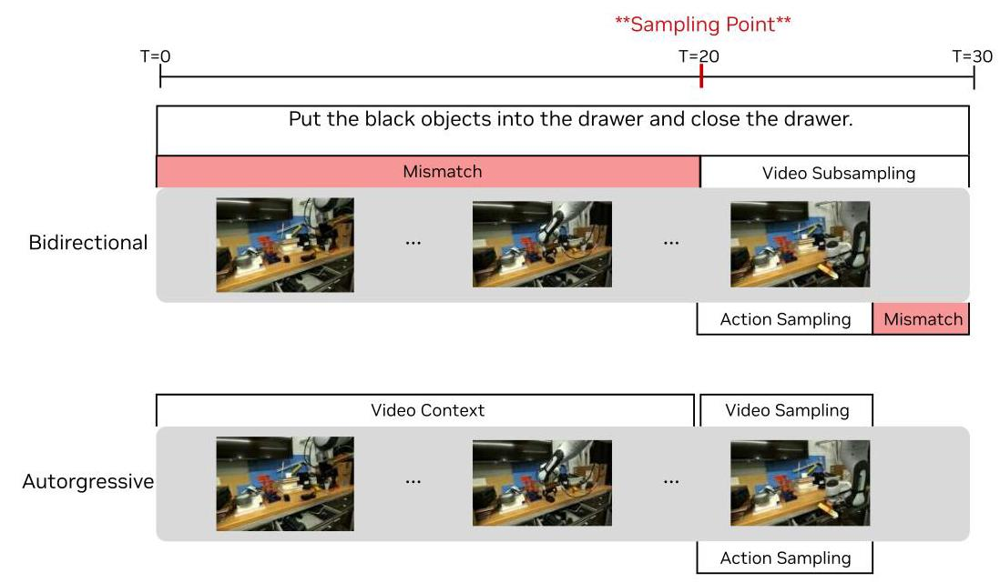

Figure 13: Bidirectional vs. Autoregressive WAMs. When the sampling point falls mid-task (T=20), bidirectional WAMs must subsample video to align with the language caption, distorting native FPS and degrading video-action alignment. Autoregressive WAMs avoid this trade-off by conditioning on video context, preserving both language-video correspondence and native frame rate.

Figure 13 illustrates a key challenge for bidirectional WAMs when training closed-loop systems. Given a language annotation in a given long-horizon demonstration, the model must learn that the instruction corresponds to a specific video interval. In bidirectional architectures, without subsampling, the model receives a language instruction (e.g., 'put the black objects into the drawer') but usually generates video covering only a fraction of the task interval, causing the language to describe actions not yet visible in the predicted frames. This mismatch leads to significant language-following degradation, as measured via an internal video prediction benchmark.

A natural solution is to subsample the video to match the task caption interval. However, this creates a new problem for closed-loop training: we need the model to receive observations from arbitrary points within a task—not just the beginning. When the sampling point falls mid-task (e.g., T=20 in Figure 13), subsampling distorts the native FPS, making video-action alignment substantially harder to learn.

Autoregressive WAMs can sidestep this dilemma. By conditioning on video context rather than subsampling, they preserve both the language-video correspondence and the native frame rate, enabling tight alignment across all three modalities: language, video, and action.

## C. Model and Training details

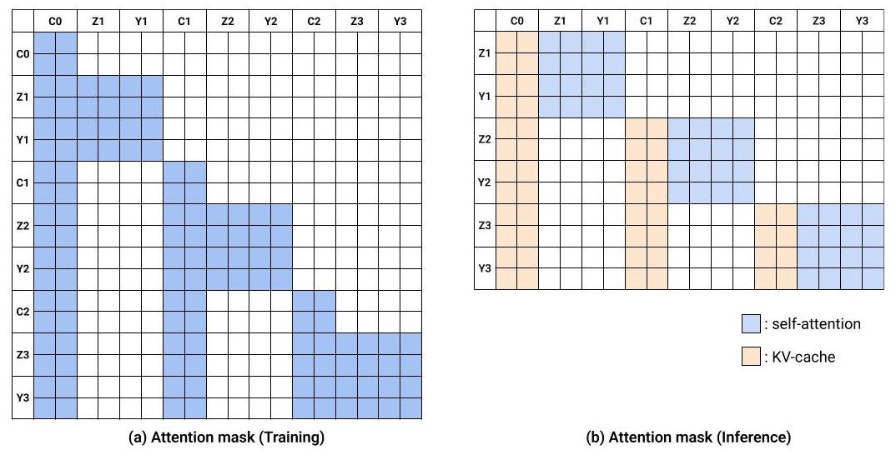

Figure 14: Attention startegy of DreamZero. (a) QKV Self-Attention mask for DreamZero training. Y-axis shows the Query (Q) and X-axis shows the Key/Value (KV). Given conditioning frames (C0, C1, C2), we train the model to predict the velocities of next frames (Z1, Z2, Z3) and actions (Y1, Y2, Y3). (b) During inference, we compute the KV-cache of conditional frames and concatenate them to predict the action and frames. For example, Y3 (action) is able to attend to C0, C1, and C2, taking into account previous visual observations as history to predict the current actions during both training and inference. Note that the C0, C1, and C2 during inference is replaced with the GT observations.

We visualize the attention mask for training and inference in Figure 14. For DREAMZERO, we set each chunk as \( K = 2 \) latent frames. From preliminary results, we have observed that \( K = 2 \) outperforms \( K = 1 \) empirically. We set the number of chunks \( M = 4 \) by default. If the trajectory length is shorter than \( M = 4, M \) can be smaller than 4. For Agibot training data, the video is sampled at 5FPS ratio and action is sampled at 30Hz. We use the action horizon of \( H = {48} \) . Therefore, the video and action span 1.6 seconds per chunk. For DROID training, the video is sampled at 5FPS ratio and action is sampled at \( {15}\mathrm{\;{Hz}} \) . We use the action horizon of \( H = {24} \) . Therefore, same as Agibot, the video and action span 1.6 seconds per chunk. The maximum context length is 8 latent frames (4x2), which is equivalent to 33 raw frames, spanning 6.6 seconds. We leave increasing the visual context for WAMs as future work.

Algorithm 1 DREAMZERO Training (Flow Matching)

---

Input: Dataset \( \mathcal{D} \) , Text condition \( \mathbf{c} \)

Hyperparams: Number of chunks \( M \)

Model: \( {\mathbf{u}}_{\theta } \) (Joint Video-Action DiT)

while not converged do

	Sample trajectory \( \tau  \sim  \mathcal{D} \)

	Encode video to clean latents \( {\mathbf{z}}_{1}^{1 : M} \) , normalize

actions \( {\mathbf{a}}_{1}^{1 : M} \)

		Split \( \tau \) into \( M \) chunks

	for \( k = 1,\ldots , M \) do \( \vartriangleright \) Chunk-wise Training

			Define clean context \( {\mathcal{C}}_{k} \leftarrow  {\left\{  \left( {\mathbf{z}}_{1}^{j},{\mathbf{a}}_{1}^{j}\right) \right\}  }_{j = 1}^{k - 1} \vartriangleright \)

TF History

			Sample timestep \( {t}_{k} \sim  \mathcal{U}\left( {0,1}\right) \)

			// Optional: DreamZero-Flash Decoupling

			if Flash Mode then

				\( {t}_{vid} \sim  \operatorname{Beta}\left( {7,1}\right) ,{t}_{act} \sim  \mathcal{U}\left( {0,1}\right) \)

			else

				\( {t}_{vid} \leftarrow  {t}_{k},{t}_{act} \leftarrow  {t}_{k} \)

			end if

			Sample noise \( {\mathbf{z}}_{0}^{k},{\mathbf{a}}_{0}^{k} \sim  \mathcal{N}\left( {\mathbf{0},\mathbf{I}}\right) \)

			Interpolate (Eq. 2):

				\( {\mathbf{z}}_{t}^{k} \leftarrow  {t}_{vid}{\mathbf{z}}_{1}^{k} + \left( {1 - {t}_{vid}}\right) {\mathbf{z}}_{0}^{k} \)

				\( {\mathbf{a}}_{t}^{k} \leftarrow  {t}_{act}{\mathbf{a}}_{1}^{k} + \left( {1 - {t}_{act}}\right) {\mathbf{a}}_{0}^{k} \)

			Predict velocity:

				\( {\mathbf{v}}_{\text{ pred }} \leftarrow  {\mathbf{u}}_{\theta }\left( {\left\lbrack  {{\mathbf{z}}_{t}^{k},{\mathbf{a}}_{t}^{k}}\right\rbrack  ;{\mathcal{C}}_{k},\mathbf{c},{\mathbf{q}}_{k},{t}_{k}}\right) \)

			Target vel. \( {\mathbf{v}}^{k} \mathrel{\text{ := }} \left\lbrack  {{\mathbf{z}}_{1}^{k},{\mathbf{a}}_{1}^{k}}\right\rbrack   - \left\lbrack  {{\mathbf{z}}_{0}^{k},{\mathbf{a}}_{0}^{k}}\right\rbrack \)

			Loss \( \mathcal{L} \leftarrow  {\begin{Vmatrix}{\mathbf{v}}_{\text{ pred }} - {\mathbf{v}}^{k}\end{Vmatrix}}^{2}\; \vartriangleright \) Eq. 3

			Update \( \theta  \leftarrow  \theta  - \eta \nabla \mathcal{L} \)

		end for

end while

---

Algorithm 2 DreamZERO Inference (Closed-Loop Control)

---

Input: Instruction c, Initial Image o \( {}_{\text{ init }} \) , State q \( {}_{\text{ init }} \)

Hyperparams: Steps \( N \) , Cache Thresh \( \epsilon \)

Init: \( \mathcal{K}\mathcal{V} \leftarrow  \varnothing ,{\mathbf{v}}_{\text{ prev }} \leftarrow  \varnothing ,{\mathbf{q}}_{\text{ curr }} \leftarrow  {\mathbf{q}}_{\text{ init }} \)

// 1. Prefill Cache (Context Phase, \( t = 0 \) )

\( {\mathbf{z}}_{\text{ init }} \leftarrow  \operatorname{VAE}\left( {\mathbf{o}}_{\text{ init }}\right) \)

// Pass clean video, no action/state

\( \left( {\cdot ,\cdot ,\mathcal{K}\mathcal{V}}\right)  \leftarrow  {\mathbf{u}}_{\theta }\left( {\left\lbrack  {{\mathbf{z}}_{\text{ init }},\varnothing }\right\rbrack  ;\mathcal{K}\mathcal{V},\mathbf{c},\varnothing ,}\right. \)

						\( t = 0 \) , update=True)

// 2. Autoregressive Loop

while task not done do

	Sample \( {\mathbf{x}}_{0} = \left\lbrack  {{\mathbf{z}}_{0},{\mathbf{a}}_{0}}\right\rbrack   \sim  \mathcal{N}\left( {\mathbf{0},\mathbf{I}}\right) \; \vartriangleright \) Noise at

\( t = 0 \)

	// Joint Denoising (Flow Matching \( t : 0 \rightarrow  1 \) )

	for \( i = 0\ldots N - 1 \) do

		\( {t}_{i},{t}_{i + 1} \leftarrow \) Scheduler \( \left( {i, N}\right) \)

		// Optimization: DiT Caching

		if \( {\mathbf{v}}_{\text{ prev }} \neq  \varnothing \) and \( \operatorname{CosSim}\left( {{\mathbf{v}}_{\text{ prev }},{\mathbf{v}}_{\text{ last }}}\right)  > \epsilon \)

then

			\( {\mathbf{v}}_{i} \leftarrow  {\mathbf{v}}_{\text{ prev }} \)

		else

			\( \left( {{\mathbf{v}}_{i}^{\text{ vid }},{\mathbf{v}}_{i}^{\text{ act }}, \cdot  }\right)  \leftarrow  {\mathbf{u}}_{\theta }\left( {{\mathbf{x}}_{{t}_{i}};\mathcal{K}\mathcal{V},\mathbf{c},{\mathbf{q}}_{\text{ curr }},}\right. \)

						\( {t}_{i} \) , update=False)

			\( {\mathbf{v}}_{i} \leftarrow  \left\lbrack  {{\mathbf{v}}_{i}^{\text{ vid }},{\mathbf{v}}_{i}^{\text{ act }}}\right\rbrack \)

			\( {\mathbf{v}}_{\text{ prev }} \leftarrow  {\mathbf{v}}_{i} \)

		end if

		// Solver Step

		\( {\mathbf{x}}_{{t}_{i + 1}} \leftarrow  {\mathbf{x}}_{{t}_{i}} + \operatorname{Step}\left( {{\mathbf{v}}_{i},{t}_{i},{t}_{i + 1}}\right) \)

	end for

	// 3. Execution & Cache Update

	\( \widehat{\mathbf{a}} \leftarrow  \operatorname{Filter}\left( {\mathbf{x}}_{1}^{\text{ action }}\right) \; \vartriangleright \) Clean Action \( t = 1 \)

	Async Execute à on Robot

	// Critical: Inject Ground Truth \( \left( {t = 0}\right) \)

	Real observation \( {\mathbf{o}}_{\text{ real }},{\mathbf{q}}_{\text{ real }} \)

	\( {\mathbf{q}}_{\text{ curr }} \leftarrow  {\mathbf{q}}_{\text{ real }},\;{\mathbf{z}}_{\text{ real }} \leftarrow  \operatorname{VAE}\left( {\mathbf{o}}_{\text{ real }}\right) \)

	\( \left( {\cdot ,\cdot ,\mathcal{K}\mathcal{V}}\right)  \leftarrow  {\mathbf{u}}_{\theta }\left( {\left\lbrack  {{\mathbf{z}}_{\text{ real }},\varnothing }\right\rbrack  ;\mathcal{K}\mathcal{V},\mathbf{c},\varnothing ,}\right. \)

						\( t = 0 \) , update=True)

	*Discard predicted video latent from \( {\mathrm{x}}_{1} \)

end while

---

## D. Real-time Execution Details

This appendix provides additional details on the system-, implementation-, and model-level optimizations introduced in Section 3.2.

### D.1. System-level Optimizations

CFG Parallelism. To address the computation bottleneck inherent to DiT, we employed Classifier-Free Guidance (CFG) parallelism. Standard CFG requires two distinct model evaluations—the conditional and unconditional forward passes-which are typically executed sequentially. We parallelized these operations by distributing the conditioned and null-conditioned score estimations across two independent GPUs. This effectively reduced the latency per diffusion step by nearly half, with no impact on overall model quality.

DiT Caching. The iterative nature of DiT inference imposes a significant computational bottleneck for real-time applications. Previous efforts have focused on training-free caching techniques that exploit temporal redundancies across diffusion steps. TeaCache (Liu et al.,2024) leverages the relative \( {L}_{1} \) difference between timestep-embedding modulated inputs as a heuristic to estimate output variance and skip redundant computations, while TaylorSeer (Liu et al., 2025) employs higher-order Taylor expansions to extrapolate future latent states from historical derivatives. In DreamZERO, we implement a caching mechanism that exploits the directional consistency of velocity vectors learned during flow matching.

During inference, the model tracks cosine similarity between successive velocity predictions. When this metric exceeds a predefined threshold \( \left( \tau \right) \) , the model bypasses the DiT forward pass for a window of a few steps by reusing the cached velocity vector. This adaptive scheduling concentrates computational resources on critical trajectory updates, reducing the average number of DiT steps from 16 to 4 with minimal degradation to predicted video and action fidelity.

Asynchronous Execution. Sequential execution of action blocks introduces stalls while waiting for upstream models to produce the next chunk, making the robot more open-loop and less reactive to real-time state changes, especially with large chunk sizes. We use an asynchronous execution mechanism that decouples model inference from action execution, allowing both stages to run concurrently. The motion controller always executes the most recent action scheduled for the current timestamp, while the inference module always uses the latest observation.

### D.2. Implementation-level Optimizations

Torch Compile and CUDA Graphs. Inference is predominantly CPU-bound due to kernel launch overheads and Python execution. We employ torch.compile with CUDA Graphs (mode="reduce-overhead") and enforce full graph capture (fullgraph=True) to eliminate graph breaks. In addition to reducing CPU overhead, torch.compile decreases memory bandwidth requirements through operator fusion. We apply compilation to five model components: the diffusion transformer, scheduler, text encoder, image encoder, and VAE. We enforce static shapes (dynamic=False), which results in multiple recompilations during the first inference trajectory due to the evolving KV cache shape. From the second trajectory onward, inference proceeds without recompilation. To enable error-free compilation, we refactor the model to follow a functional programming paradigm: the KV cache is passed explicitly as input and returned as output of the compiled function.

Post-Training Quantization. We implement a mixed-precision strategy using the NVIDIA Model Optimizer (NVIDIA Corporation, 2024) on Blackwell (SM100) architecture. We quantize model weights and activations to NVFP4 (E2M1) while maintaining sensitive QKV projections and Softmax operations in FP8 (E4M3). To preserve numerical stability, we employ FP16 accumulation for non-linear operations including LayerNorm and RoPE. This configuration improves latency with negligible impact on generated video and action quality.

Kernel-Level Enhancements. We use the cuDNN backend for dot-product attention via PyTorch Scaled Dot-Product Attention (SDPA), requiring PyTorch version ≥2.9. Earlier versions of the Transformer Engine library may also access these efficient cuDNN kernels.

Scheduler Optimizations. The initial Flow UniPC scheduler (Zhao et al., 2023) implementation required CPU execution for several operations, causing frequent CPU-GPU synchronization and GPU stalls. We migrated these operations to GPU, eliminating unnecessary CPU overhead.

### D.3. Model-level Optimizations - DreamZero-Flash

In the standard DreamZero formulation, video and action modalities share the same denoising timestep \( {t}_{k} \) :

\[
{t}_{k}^{\text{ video }} = {t}_{k}^{\text{ action }} = {t}_{k},\;{t}_{k} \sim  \mathcal{U}\left( {0,1}\right) \tag{4}
\]

DREAMZERO-Flash decouples these schedules by biasing video timesteps toward lower values (higher noise) while keeping action timesteps uniform:

\[
{t}_{k}^{\text{ video }} = 1 - \eta ,\;\eta  \sim  \operatorname{Beta}\left( {\alpha ,\beta }\right) ,\;{t}_{k}^{\text{ action }} \sim  \mathcal{U}\left( {0,1}\right) \tag{5}
\]

where \( \alpha  > \beta \) (e.g., \( \alpha  = 7,\beta  = 1 \) ). Since \( \operatorname{Beta}\left( {\alpha ,\beta }\right) \) with \( \alpha  > \beta \) concentrates mass near \( \eta  \approx  1 \) , the transformed variable \( {t}_{k}^{\text{ video }} = 1 - \eta \) is biased toward 0, corresponding to high-noise video states. The noisy samples become:

\[
{\mathbf{z}}_{{t}_{k}^{\text{ video }}}^{k} = {t}_{k}^{\text{ video }}{\mathbf{z}}_{1}^{k} + \left( {1 - {t}_{k}^{\text{ video }}}\right) {\mathbf{z}}_{0}^{k},\;{\mathbf{a}}_{{t}_{k}^{\text{ action }}}^{k} = {t}_{k}^{\text{ action }}{\mathbf{a}}_{1}^{k} + \left( {1 - {t}_{k}^{\text{ action }}}\right) {\mathbf{a}}_{0}^{k} \tag{6}
\]

For Beta \( \left( {7,1}\right) ,\mathbb{E}\left\lbrack  \eta \right\rbrack   = {0.875} \) , yielding \( \mathbb{E}\left\lbrack  {t}_{k}^{\text{ video }}\right\rbrack   = {0.125} \) compared to 0.5 in the coupled setting. This exposes the model during training to configurations where actions must be predicted from predominantly noisy visual context (Figure 5), aligning training with rapid-action-denoising inference where actions denoise from noise level \( 1 \rightarrow  0 \) in one step while video remains partially noisy.

Action Chunk Smoothing. Generated action chunks may contain high-frequency noise from denoising. We apply filtering to ensure stable real-world behavior: first upsampling the action chunk to \( 2 \times \) resolution via cubic interpolation, then applying a Savitzky-Golay filter (window size 21, polynomial order 3) to suppress noise while preserving trajectory shape, and finally downsampling to original resolution.

## E. AgiBot Diverse Data Collection Strategy

Our data collection philosophy prioritizes diversity over repetition. Unlike conventional approaches that collect hundreds of demonstrations per task in controlled lab settings, we collect data across 22 real-world environments spanning homes, restaurants, supermarkets, coffee shops, offices, warehouses, laboratories, and hotels (Figure 15).

### E.1. Daily Collection Workflow

Each day, teleoperators receive a printed task sheet listing available tasks for their assigned area (e.g., kitchen area, checkout counter). For each episode, they select three tasks (usually very coarse-grained like "tidy up") from this sheet and execute them consecutively. Each task typically requires 1-2 minutes, resulting in approximately 5-minute episodes.

At the end of each day, teleoperators log the frequency count for each task. Once a task was collected in 50 episodes, it is deprecated and removed from the task sheet. Teleoperators are incentivized to propose new tasks, which they inevitably must do as existing tasks become deprecated. This mechanism continuously expands the task distribution throughout data collection, yielding a long-tail of diverse behaviors.

Because we prioritize utility over repetition, our tasks are naturally more coarse-grained than typical robot learning datasets. Examples include organizing items, ground garbage cleaning, shopping basket return, toy box tidying, table tidying, and clothes hanging-but the full set grows organically as the collection progresses.

### E.2. Multi-Task Episode Structure

The three-task episode structure serves two purposes: it maximizes diversity within each episode and encourages the model to learn smooth task transitions. For example, a single episode might involve (1) clearing dishes from a table, (2) wiping the table surface, and (3) organizing condiments. This design yields an average of 42 subtasks per episode (Figure 6), significantly more than typical single-task datasets.

This combination of environment diversity, task deprecation with forced expansion, and multi-task episodes produces a heterogeneous dataset that differs substantially from conventional robot learning corpora. Rather than learning narrow task-specific policies, DreamXEro learns generalizable skills that transfer across environments and tasks. See https://dreamzero0.github.io/training_data_gallery/ for examples of these coarse-grained tasks (the videos shown in the website concatenated each coarse-grained tasks)

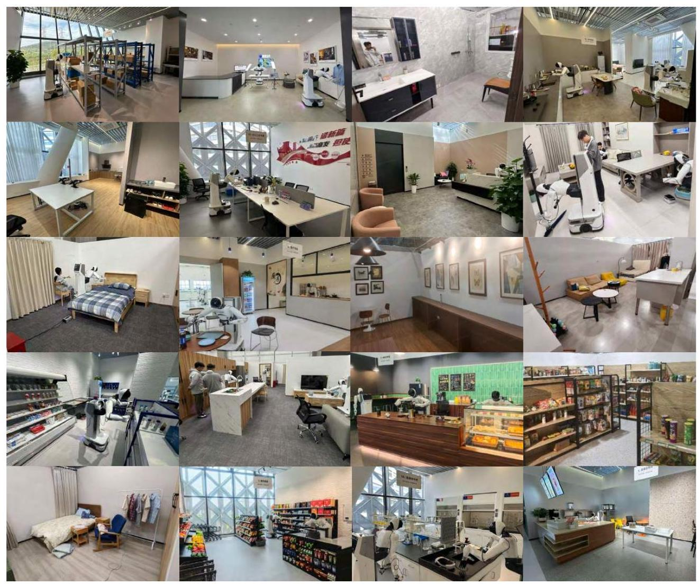

Figure 15: Data Collection Environments. We collect teleoperation data across 22 diverse real-world environments, including offices, laboratories, restaurants, supermarkets, coffee shops, warehouses, homes, hotels, and retail stores. This diversity enables DREAMZERO to generalize to unseen environments without task-specific fine-tuning.

## F. AgiBot Evaluation Details

We provide the evaluation setup for both seen tasks in Tables 5 and unseen tasks in Table 6 for Agibot. Each row shows the initial frame and instruction for 4 robots. We conduct 2 rollouts per robot for each task by varying the objects, locations and the robot arm to use for the task (The current table mostly shows the evaluation using the left arm).

## G. DROID Evaluation Details

We provide the evaluation setup for both seen and unseen tasks in Tables 7a and 7b for DROID. We conduct 2 rollouts per task by varying the location of the objects.

Table 5: Seen Tasks Evaluation Setup for AgiBot G1

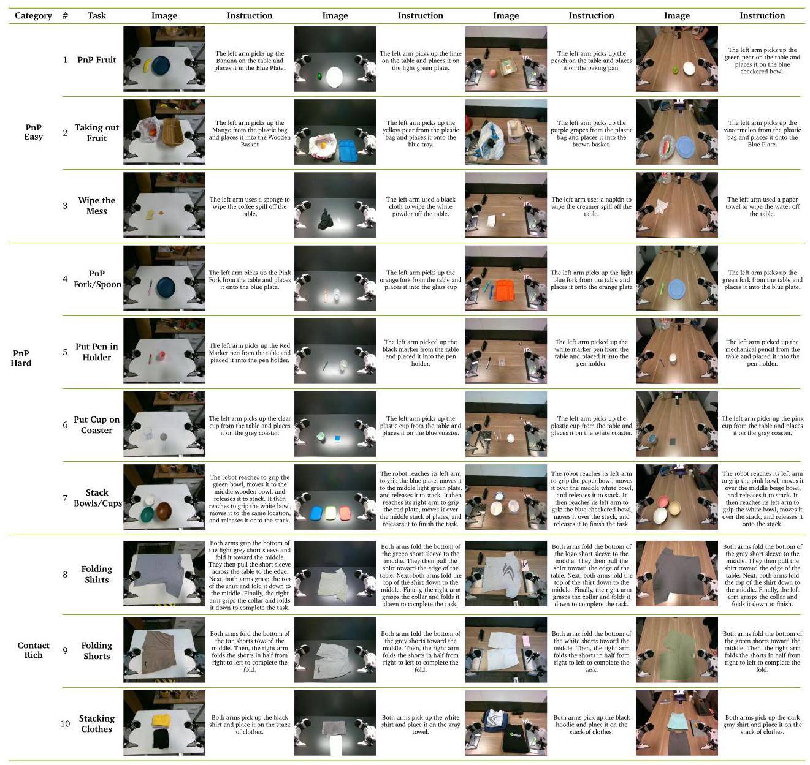

## Table 6: Unseen Tasks Evaluation Setup for AgiBot G1

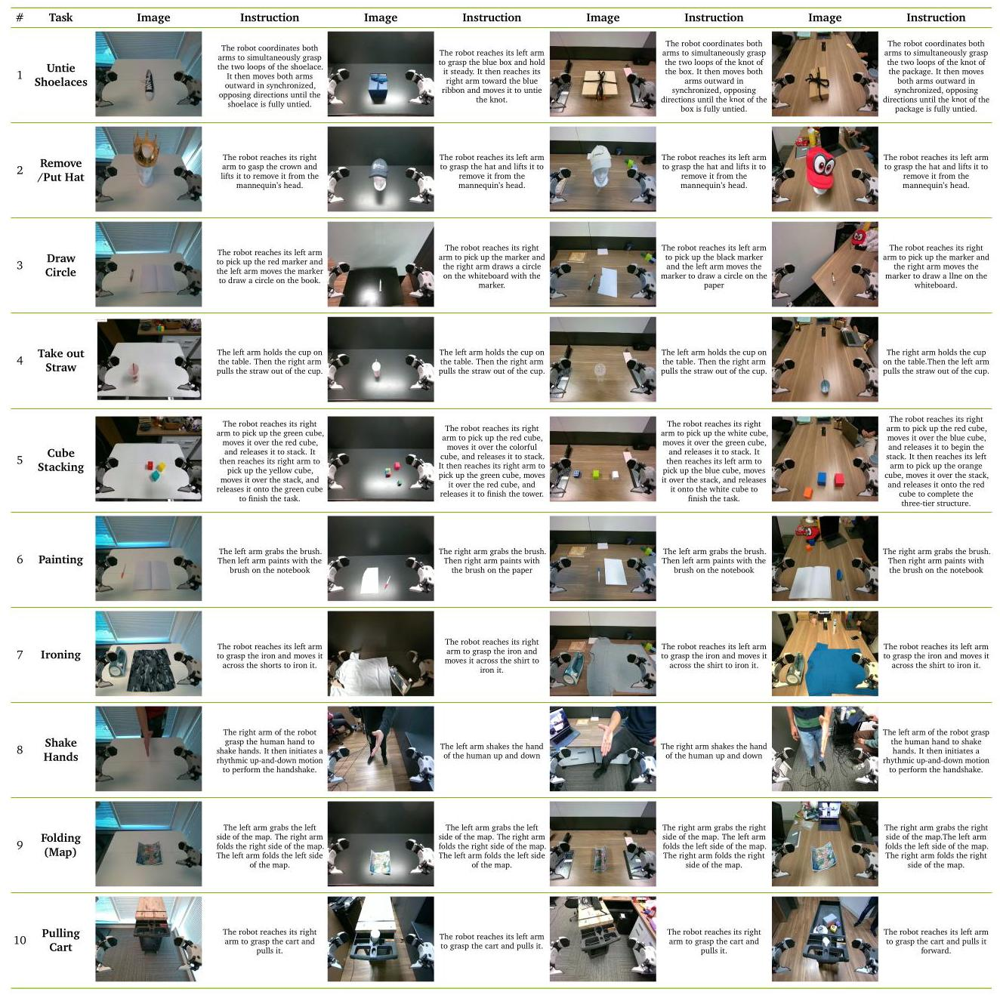

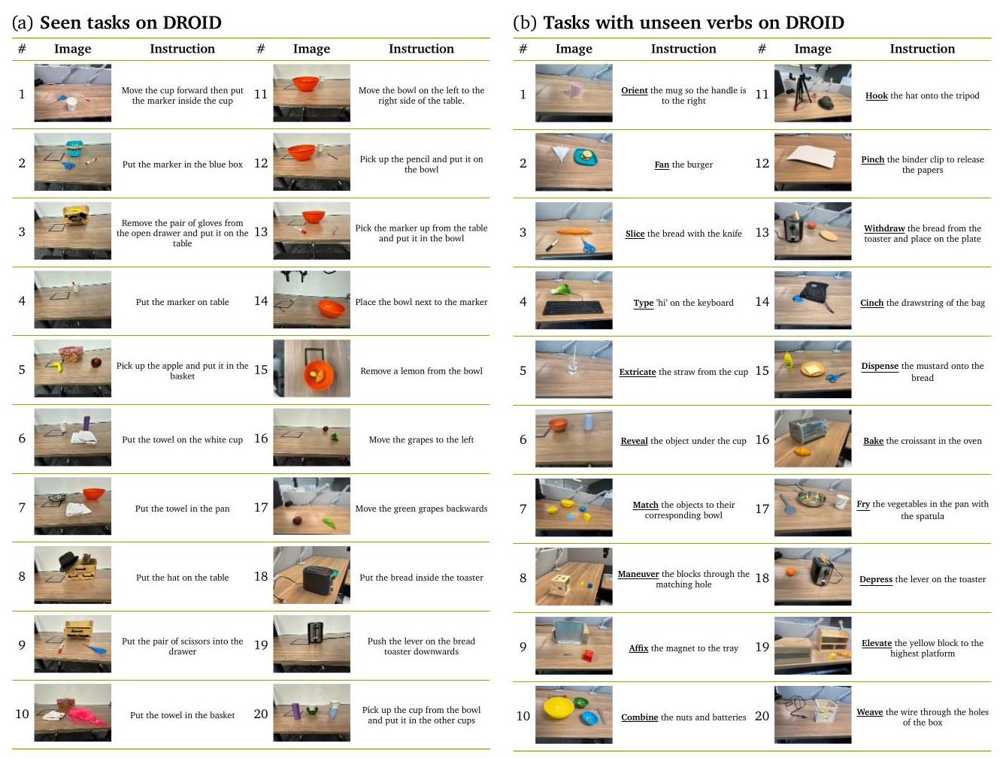

## H. Failure Case Analysis

In Figure 16, we illustrate the generated video by DREAMZERO and execution rollout for both AgiBot and DROID. Overall, the robot execution follows the visual plan generated on the video modality side. For AgiBot video generated by DREAMZERO, the robot picks up the marker with left arm and passes the marker to the right arm. Consistent with the generated video, for the execution rollout, the robot picks up the top part of the marker, but instead of drawing a line on the whiteboard, the left arm passes the marker to the right arm. For DROID video generated by DREAMZERO, the robot picks up the bread instead of opening the oven first. Aligned with the generated video, for the execution rollout, the robot picks up the bread first instead of opening the oven, leading to the rollout being stuck after the robot has reached to the oven with bread held. This implies that improving the language following and visual planning capability of WAMs could potentially lead to better action execution.

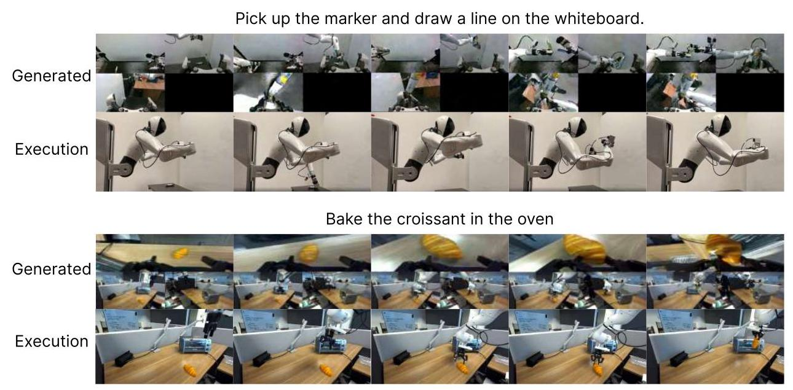

Figure 16: Illustration of generated and executed pair. We illustrate the generated video and action execution pair. These two examples show scenarios where the video prediction failed and the robot followed the failed plan. DREAMZERO failed to generate video of the Agibot G1 robot drawing in the whiteboard and failed to generate video of the Franka robot opening the oven first.

## References

[1] Michael S Albergo, Nicholas M Boffi, and Eric Vanden-Eijnden. Stochastic interpolants: A unifying framework for flows and diffusions. arXiv preprint arXiv:2303.08797, 2023. 7

[2] Arslan Ali, Junjie Bai, Maciej Bala, Yogesh Balaji, Aaron Blakeman, Tiffany Cai, Jiaxin Cao, Tianshi Cao, Elizabeth Cha, Yu-Wei Chao, et al. World simulation with video foundation models for physical ai. arXiv preprint arXiv:2511.00062, 2025. 7

[3] Mahmoud Assran, Quentin Duval, Ishan Misra, Piotr Bojanowski, Pascal Vincent, Michael Rabbat, Yann LeCun, and Nicolas Ballas. Self-supervised learning from images with a joint-embedding predictive architecture. In Proceedings of the IEEE/CVF Conference on Computer Vision and Pattern Recognition, 2023. 20

[4] Mido Assran, Adrien Bardes, David Fan, Quentin Garrido, Russell Howes, Mojtaba Komeili, Matthew Muckley, Ammar Rizvi, Claire Roberts, Koustuv Sinha, et al. V-JEPA 2: Self-supervised video models enable understanding, prediction and planning. arXiv preprint arXiv:2506.09985, 2025. 5, 20

[5] Philip J. Ball, Jakob Bauer, Frank Belletti, Bethanie Brownfield, Ariel Ephrat, Shlomi Fruchter, Agrim Gupta, Kristian Holsheimer, Aleksander Holynski, Jiri Hron, Christos Kaplanis, Marjorie Limont, Matt McGill, Yanko Oliveira, Jack Parker-Holder, Frank Perbet, Guy Scully, Jeremy Shar, Stephen Spencer, Omer Tov, Ruben Villegas, Emma Wang, Jessica Yung, Cip Baetu, Jordi Berbel, David Bridson, Jake Bruce, Gavin Buttimore, Sarah Chakera, Bilva Chandra, Paul Collins, Alex Cullum, Bogdan Damoc, Vibha Dasagi, Maxime Gazeau, Charles Gbadamosi, Woohyun Han, Ed Hirst, Ashyana Kachra, Lucie Kerley, Kristian Kjems, Eva Knoepfel, Vika Koriakin, Jessica Lo, Cong Lu, Zeb Mehring, Alex Moufarek, Henna Nandwani, Valeria Oliveira, Fabio Pardo, Jane Park, Andrew Pierson, Ben Poole, Helen Ran, Tim Salimans, Manuel Sanchez, Igor Saprykin, Amy Shen, Sailesh Sidhwani, Duncan Smith, Joe Stanton, Hamish Tomlinson, Dimple Vijaykumar, Luyu Wang, Piers Wingfield, Nat Wong, Keyang Xu, Christopher Yew, Nick Young, Vadim Zubov, Douglas Eck, Dumitru Erhan, Koray Kavukcuoglu, Demis Hassabis, Zoubin Gharamani, Raia Hadsell, Aäron van den Oord, Inbar Mosseri, Adrian Bolton, Satinder Singh, and Tim Rocktäschel. Genie 3: A new frontier for world models. 2025. URL https://deepmind.google/discover/blog/ genie-3-a-new-frontier-for-world-models/. 19

[6] Adrien Bardes, Quentin Garrido, Jean Ponce, Michael Rabbat, Yann LeCun, Mahmoud Assran, and Nicolas Ballas. V-JEPA: Video joint embedding predictive architecture. arXiv preprint arXiv:2402.05065, 2024. 20

[7] Jose Barreiros, Andrew Beaulieu, Aditya Bhat, Rick Cory, Eric Cousineau, Hongkai Dai, Ching-Hsin Fang, Kunimatsu Hashimoto, Muhammad Zubair Irshad, Masha Itkina, et al. A careful examination of large behavior models for multitask dexterous manipulation. arXiv preprint arXiv:2507.05331, 2025. 13

[8] Homanga Bharadhwaj, Debidatta Dwibedi, Abhinav Gupta, Shubham Tulsiani, Carl Doersch, Ted Xiao, Dhruv Shah, Fei Xia, Dorsa Sadigh, and Sean Kirmani. Gen2act: Human video generation in novel scenarios enables generalizable robot manipulation. arXiv preprint arXiv:2409.16283, 2024. 5

[9] Johan Bjorck, Fernando Castañeda, Nikita Cherniadev, Xingye Da, Runyu Ding, Linxi Fan, Yu Fang, Dieter Fox, Fengyuan Hu, Spencer Huang, et al. Gr00t n1: An open foundation model for generalist humanoid robots. arXiv preprint arXiv:2503.14734, 2025. 2, 4, 10, 18

[10] Kevin Black, Noah Brown, Danny Driess, Adnan Esmail, Michael Equi, Chelsea Finn, Niccolo Fusai, Lachy Groom, Karol Hausman, Brian Ichter, et al. \( {\pi }_{0} \) : A vision-language-action flow model for general robot control. arXiv preprint arXiv:2410.24164, 2024. 4

[11] Kevin Black, Noah Brown, Danny Driess, Adnan Esmail, Michael Equi, Chelsea Finn, Niccolo Fusai, Lachy Groom, Karol Hausman, Brian Ichter, et al. π0: A vision-language-action flow model for general robot control. URL https://arxiv.org/abs/2410.24164, 2024. 2

[12] Rishi Bommasani, Drew A Hudson, Ehsan Adeli, Russ Altman, Simran Arora, Sydney von Arx, Michael S Bernstein, Jeannette Bohg, Antoine Bosselut, Emma Brunskill, et al. On the opportunities and risks of foundation models. arXiv preprint arXiv:2108.07258, 2021. 4

[13] Anthony Brohan, Noah Brown, Justice Carbajal, Yevgen Chebotar, Joseph Dabis, Chelsea Finn, Keerthana Gopalakrishnan, Karol Hausman, Alex Herzog, Jasmine Hsu, Julian Ibarz, Brian Ichter, Alex Irpan, Tomas Jackson, Sally Jesmonth, Nikhil Joshi, Ryan Julian, Dmitry Kalashnikov, Yuheng Kuang, Isabel Leal, Kuang-Huei Lee, Sergey Levine, Yao Lu, Utsav Malla, Deeksha Manjunath, Igor Mordatch, Ofir Nachum, Carolina Parada, Jodilyn Peralta, Emily Perez, Karl Pertsch, Jornell Quiambao, Kanishka Rao, Michael Ryoo, Grecia Salazar, Pannag Sanketi, Kevin Sayed, Jaspiar Singh, Sumedh Sontakke, Austin Stone, Clayton Tan, Huong Tran, Vincent Vanhoucke, Steve Vega, Quan Vuong, Fei Xia, Ted Xiao, Peng Xu, Sichun Xu, Tianhe Yu, and Brianna Zitkovich. Rt-1: Robotics transformer for real-world control at scale. In arXiv preprint arXiv:2212.06817, 2022. 4

[14] Anthony Brohan, Noah Brown, Justice Carbajal, Yevgen Chebotar, Xi Chen, Krzysztof Choromanski, Tianli Ding, Danny Driess, Avinava Dubey, Chelsea Finn, Pete Florence, Chuyuan Fu, Montse Gonzalez Arenas, Keerthana Gopalakrishnan, Kehang Han, Karol Hausman, Alex Herzog, Jasmine Hsu, Brian Ichter, Alex Irpan, Nikhil Joshi, Ryan Julian, Dmitry Kalashnikov, Yuheng Kuang, Isabel Leal, Lisa Lee, Tsang-Wei Edward Lee, Sergey Levine, Yao Lu, Henryk Michalewski, Igor Mordatch, Karl Pertsch, Kanishka Rao, Krista Reymann, Michael Ryoo, Grecia Salazar, Pannag Sanketi, Pierre Sermanet, Jaspiar Singh, Anikait Singh, Radu Soricut, Huong Tran, Vincent Vanhoucke, Quan Vuong, Ayzaan Wahid, Stefan Welker, Paul Wohlhart, Jialin Wu, Fei Xia, Ted Xiao, Peng Xu, Sichun Xu, Tianhe Yu, and Brianna Zitkovich. Rt-2: Vision-language-action models transfer web knowledge to robotic control. In arXiv preprint arXiv:2307.15818, 2023. 2,4

[15] Anthony Brohan, Yevgen Chebotar, Chelsea Finn, Karol Hausman, Alexander Herzog, Daniel Ho, Julian Ibarz, Alex Irpan, Eric Jang, Ryan Julian, et al. Do as i can, not as i say: Grounding language in robotic affordances. In Conference on robot learning, pages 287-318. PMLR, 2023. 4

[16] Qingwen Bu, Yanting Yang, Jisong Cai, Shenyuan Gao, Guanghui Ren, Maoqing Yao, Ping Luo, and Hongyang Li. Univla: Learning to act anywhere with task-centric latent actions. arXiv preprint arXiv:2505.06111, 2025. 4

[17] Chi-Lam Cheang, Guangzeng Chen, Ya Jing, Tao Kong, Hang Li, Yifeng Li, Yuxiao Liu, Hongtao Wu, Jiafeng Xu, Yichu Yang, et al. Gr-2: A generative video-language-action model with web-scale knowledge for robot manipulation. arXiv preprint arXiv:2410.06158, 2024. 5

[18] Boyuan Chen, Zhuo Xu, Sean Kirmani, Brain Ichter, Dorsa Sadigh, Leonidas Guibas, and Fei Xia. Spa-tialvlm: Endowing vision-language models with spatial reasoning capabilities. In Proceedings of the IEEE/CVF Conference on Computer Vision and Pattern Recognition, pages 14455-14465, 2024. 2

[19] Boyuan Chen, Tianyuan Zhang, Haoran Geng, Kiwhan Song, Caiyi Zhang, Peihao Li, William T Freeman, Jitendra Malik, Pieter Abbeel, Russ Tedrake, et al. Large video planner enables generalizable robot control. arXiv preprint arXiv:2512.15840, 2025. 5

[20] Delong Chen, Tejaswi Kasarla, Yejin Bang, Mustafa Shukor, Willy Chung, Jade Yu, Allen Bolourchi, Theo Moutakanni, and Pascale Fung. Action100m: A large-scale video action dataset. arXiv preprint arXiv:2601.10592, 2026. 18

[21] Chaorui Deng, Deyao Zhu, Kunchang Li, Chenhui Gou, Feng Li, Zeyu Wang, Shu Zhong, Weihao Yu, Xiaonan Nie, Ziang Song, et al. Emerging properties in unified multimodal pretraining. arXiv preprint arXiv:2505.14683, 2025. 19

[22] Kamil Dreczkowski, Pietro Vitiello, Vitalis Vosylius, and Edward Johns. Learning a thousand tasks in a day. Science Robotics, 10(108):eadv7594, 2025. 4

[23] Danny Driess, Fei Xia, Mehdi SM Sajjadi, Corey Lynch, Aakanksha Chowdhery, Brian Ichter, Ayzaan Wahid, Jonathan Tompson, Quan Vuong, Tianhe Yu, et al. Palm-e: An embodied multimodal language model. arXiv preprint arXiv:2303.03378, 2023. 4

[24] Yilun Du, Sherry Yang, Bo Dai, Hanjun Dai, Ofir Nachum, Josh Tenenbaum, Dale Schuurmans, and Pieter Abbeel. Learning universal policies via text-guided video generation. Advances in neural information processing systems, 36:9156-9172, 2023. 5

[25] Yilun Du, Sherry Yang, Pete Florence, Fei Xia, Ayzaan Wahid, brian ichter, Pierre Sermanet, Tianhe Yu, Pieter Abbeel, Joshua B. Tenenbaum, Leslie Pack Kaelbling, Andy Zeng, and Jonathan Tompson. Video language planning. In The Twelfth International Conference on Learning Representations, 2024. URL https://openreview.net/forum?id=9pKtcJcMP3.5

[26] Zhiyuan Feng, Zhaolu Kang, Qijie Wang, Zhiying Du, Jiongrui Yan, Shubin Shi, Chengbo Yuan, Huizhi Liang, Yu Deng, Qixiu Li, et al. Seeing across views: Benchmarking spatial reasoning of vision-language models in robotic scenes. arXiv preprint arXiv:2510.19400, 2025. 2

[27] Jensen Gao, Suneel Belkhale, Sudeep Dasari, Ashwin Balakrishna, Dhruv Shah, and Dorsa Sadigh. A taxonomy for evaluating generalist robot policies. arXiv preprint arXiv:2503.01238, 2025. 4

[28] Kaifeng Gao, Jiaxin Shi, Hanwang Zhang, Chunping Wang, Jun Xiao, and Long Chen. Ca2-vdm: Efficient autoregressive video diffusion model with causal generation and cache sharing. arXiv preprint arXiv:2411.16375, 2024. 7

[29] Gemini Robotics Team. Gemini robotics: Bringing ai into the physical world. arXiv preprint arXiv:2503.20020, 2025. 2, 4, 5

[30] Kristen Grauman, Andrew Westbury, Eugene Byrne, Zachary Chavis, Antonino Furnari, Rohit Girdhar, Jackson Hamburger, Hao Jiang, Miao Liu, Xingyu Liu, et al. Ego4d: Around the world in 3,000 hours of egocentric video. In Proceedings of the IEEE/CVF Conference on Computer Vision and Pattern Recognition, 2022. 18

[31] Pranav Guruprasad, Yangyue Wang, Sudipta Chowdhury, Harshvardhan Sikka, and Paul Pu Liang. Benchmarking vision, language, & action models in procedurally generated, open ended action environments. arXiv preprint arXiv:2505.05540, 2025. 2

[32] Danijar Hafner, Timothy Lillicrap, Jimmy Ba, and Mohammad Norouzi. Dream to control: Learning behaviors by latent imagination. arXiv preprint arXiv:1912.01603, 2019. 5, 20

[33] Danijar Hafner, Timothy Lillicrap, Mohammad Norouzi, and Jimmy Ba. Mastering atari with discrete world models. arXiv preprint arXiv:2010.02193, 2020. 5, 20

[34] Danijar Hafner, Jurgis Pasukonis, Jimmy Ba, and Timothy Lillicrap. Mastering diverse domains through world models. arXiv preprint arXiv:2301.04104, 2023. 5, 20

[35] Danijar Hafner, Wilson Yan, and Timothy Lillicrap. Training agents inside of scalable world models, 2025. URL https://arxiv.org/abs/2509.24527.20

[36] Jonathan Ho and Tim Salimans. Classifier-free diffusion guidance. arXiv preprint arXiv:2207.12598, 2022. 8

[37] Ryan Hoque, Peide Huang, David J Yoon, Mouli Sivapurapu, and Jian Zhang. Egodex: Learning dexterous manipulation from large-scale egocentric video. arXiv preprint arXiv:2505.11709, 2025. 18

[38] Edward J Hu, Yelong Shen, Phillip Wallis, Zeyuan Allen-Zhu, Yuanzhi Li, Shean Wang, Lu Wang, Weizhu Chen, et al. Lora: Low-rank adaptation of large language models. ICLR, 1(2):3, 2022. 11

[39] Yucheng Hu, Yanjiang Guo, Pengchao Wang, Xiaoyu Chen, Yen-Jen Wang, Jianke Zhang, Koushil Sreenath, Chaochao Lu, and Jianyu Chen. Video prediction policy: A generalist robot policy with predictive visual representations. arXiv preprint arXiv:2412.14803, 2024. 5

[40] Wenlong Huang, Fei Xia, Ted Xiao, Harris Chan, Jacky Liang, Pete Florence, Andy Zeng, Jonathan Tompson, Igor Mordatch, Yevgen Chebotar, et al. Inner monologue: Embodied reasoning through planning with language models. In 6th Annual Conference on Robot Learning. 4

[41] Wenlong Huang, Chen Wang, Ruohan Zhang, Yunzhu Li, Jiajun Wu, and Li Fei-Fei. Voxposer: Composable 3d value maps for robotic manipulation with language models. arXiv preprint arXiv:2307.05973, 2023. 4

[42] Wenlong Huang, Yu-Wei Chao, Arsalan Mousavian, Ming-Yu Liu, Dieter Fox, Kaichun Mo, and Li Fei-Fei. Pointworld: Scaling 3d world models for in-the-wild robotic manipulation. arXiv preprint arXiv:2601.03782, 2025. 20

[43] Xun Huang, Zhengqi Li, Guande He, Mingyuan Zhou, and Eli Shechtman. Self forcing: Bridging the train-test gap in autoregressive video diffusion. arXiv preprint arXiv:2506.08009, 2025. 8

[44] Team HunyuanWorld. Hy-world 1.5: A systematic framework for interactive world modeling with real-time latency and geometric consistency. arXiv preprint, 2025. 19

[45] Arhan Jain, Mingtong Zhang, Kanav Arora, William Chen, Marcel Torne, Muhammad Zubair Irshad, Sergey Zakharov, Yue Wang, Sergey Levine, Chelsea Finn, et al. Polaris: Scalable real-to-sim evaluations for generalist robot policies. arXiv preprint arXiv:2512.16881, 2025. 11

[46] Joel Jang, Seonghyeon Ye, Zongyu Lin, Jiannan Xiang, Johan Bjorck, Yu Fang, Fengyuan Hu, Spencer Huang, Kaushil Kundalia, Yen-Chen Lin, Loic Magne, Ajay Mandlekar, Avnish Narayan, You Liang Tan, Guanzhi Wang, Jing Wang, Qi Wang, Yinzhen Xu, Xiaohui Zeng, Kaiyuan Zheng, Ruijie Zheng, Ming-Yu Liu, Luke Zettlemoyer, Dieter Fox, Jan Kautz, Scott Reed, Yuke Zhu, and Linxi Fan. Dreamgen: Unlocking generalization in robot learning through video world models. In 9th Annual Conference on Robot Learning, 2025. URL https://openreview.net/forum?id=3CnxNqmklv.5

[47] Yang Jin, Zhicheng Sun, Ningyuan Li, Kun Xu, Hao Jiang, Nan Zhuang, Quzhe Huang, Yang Song, Yadong Mu, and Zhouchen Lin. Pyramidal flow matching for efficient video generative modeling. arXiv preprint arXiv:2410.05954, 2024. 7

[48] Leslie Pack Kaelbling and Tomás Lozano-Pérez. 1 rationally engineering rational robots. 4

[49] Jared Kaplan, Sam McCandlish, Tom Henighan, Tom B Brown, Benjamin Chess, Rewon Child, Scott Gray, Alec Radford, Jeffrey Wu, and Dario Amodei. Scaling laws for neural language models. arXiv preprint arXiv:2001.08361, 2020. 18

[50] Simar Kareer, Karl Pertsch, James Darpinian, Judy Hoffman, Danfei Xu, Sergey Levine, Chelsea Finn, and Suraj Nair. Emergence of human to robot transfer in vision-language-action models. arXiv preprint arXiv:2512.22414, 2025. 16

[51] Alexander Khazatsky, Karl Pertsch, Suraj Nair, Ashwin Balakrishna, Sudeep Dasari, Siddharth Karamcheti, Soroush Nasiriany, Mohan Kumar Srirama, Lawrence Yunliang Chen, Kirsty Ellis, et al. Droid: A large-scale in-the-wild robot manipulation dataset. arXiv preprint arXiv:2403.12945, 2024. 10, 11

[52] Moo Jin Kim, Karl Pertsch, Siddharth Karamcheti, Ted Xiao, Ashwin Balakrishna, Suraj Nair, Rafael Rafailov, Ethan Foster, Grace Lam, Pannag Sanketi, Quan Vuong, Thomas Kollar, Benjamin Burchfiel, Russ Tedrake, Dorsa Sadigh, Sergey Levine, Percy Liang, and Chelsea Finn. Openvla: An open-source vision-language-action model. arXiv preprint arXiv:2406.09246, 2024. 4

[53] Moo Jin Kim, Karl Pertsch, Siddharth Karamcheti, Ted Xiao, Ashwin Balakrishna, Suraj Nair, Rafael Rafailov, Ethan Foster, Grace Lam, Pannag Sanketi, et al. Openvla: An open-source vision-language-action model. arXiv preprint arXiv:2406.09246, 2024. 2

[54] Moo Jin Kim, Yihuai Gao, Tsung-Yi Lin, Yen-Chen Lin, Yunhao Ge, Grace Lam, Percy Liang, Shuran Song, Ming-Yu Liu, Chelsea Finn, et al. Cosmos policy: Fine-tuning video models for visuomotor control and planning. arXiv preprint arXiv:2601.16163, 2026. 2, 5, 7, 19

[55] Po-Chen Ko, Jiayuan Mao, Yilun Du, Shao-Hua Sun, and Joshua B. Tenenbaum. Learning to act from actionless videos through dense correspondences. In The Twelfth International Conference on Learning Representations, 2024. URL https://openreview.net/forum?id=Mhb5fpA1TO.5

[56] Nishanth Kumar, William Shen, Fabio Ramos, Dieter Fox, Tomás Lozano-Pérez, Leslie Pack Kaelbling, and Caelan Reed Garrett. Open-world task and motion planning via vision-language model generated constraints. IEEE Robotics and Automation Letters, pages 1-8, 2026. doi: 10.1109/LRA.2026.3656799. 4

[57] Yann LeCun. A path towards autonomous machine intelligence. Open Review, 2022. 20

[58] Jason Lee, Jiafei Duan, Haoquan Fang, Yuquan Deng, Shuo Liu, Boyang Li, Bohan Fang, Jieyu Zhang, Yi Ru Wang, Sangho Lee, et al. Molmoact: Action reasoning models that can reason in space. arXiv preprint arXiv:2508.07917, 2025. 4

[59] Lin Li, Qihang Zhang, Yiming Luo, Shuai Yang, Ruilin Wang, Fei Han, Mingrui Yu, Zelin Gao, Nan Xue, Xing Zhu, Yujun Shen, and Yinghao Xu. Causal world modeling for robot control. arXiv preprint arXiv:2601.21998, 2026. 7

[60] Shuang Li, Yihuai Gao, Dorsa Sadigh, and Shuran Song. Unified video action model. arXiv preprint arXiv:2503.00200, 2025. 5, 7

[61] Yi Li, Yuquan Deng, Jesse Zhang, Joel Jang, Marius Memmel, Raymond Yu, Caelan Reed Garrett, Fabio Ramos, Dieter Fox, Anqi Li, et al. Hamster: Hierarchical action models for open-world robot manipulation. arXiv preprint arXiv:2502.05485, 2025. 4

[62] Junbang Liang, Ruoshi Liu, Ege Ozguroglu, Sruthi Sudhakar, Achal Dave, Pavel Tokmakov, Shuran Song, and Carl Vondrick. Dreamitate: Real-world visuomotor policy learning via video generation. In 8th Annual Conference on Robot Learning, 2024. URL https://openreview.net/forum?id=InT87E5sr4.5

[63] Junbang Liang, Pavel Tokmakov, Ruoshi Liu, Sruthi Sudhakar, Paarth Shah, Rares Ambrus, and Carl Vondrick. Video generators are robot policies. arXiv preprint arXiv:2508.00795, 2025. 2, 5

[64] Yue Liao, Pengfei Zhou, Siyuan Huang, Donglin Yang, Shengcong Chen, Yuxin Jiang, Yue Hu, Jingbin Cai, Si Liu, Jianlan Luo, et al. Genie envisioner: A unified world foundation platform for robotic manipulation. arXiv preprint arXiv:2508.05635, 2025. 3, 5, 7

[65] Yaron Lipman, Ricky TQ Chen, Heli Ben-Hamu, Maximilian Nickel, and Matt Le. Flow matching for generative modeling. arXiv preprint arXiv:2210.02747, 2022. 7

[66] Feng Liu, Shiwei Zhang, Xiaofeng Wang, Yujie Wei, Haonan Qiu, Yuzhong Zhao, Yingya Zhang, Qixiang Ye, and Fang Wan. Timestep embedding tells: It's time to cache for video diffusion model. arXiv preprint arXiv:2411.19108, 2024. 23

[67] Jiacheng Liu, Chang Zou, Yuanhuiyi Lyu, Junjie Chen, and Linfeng Zhang. From reusing to forecasting: Accelerating diffusion models with taylorseers. arXiv preprint arXiv:2503.06923, 2025. 23

[68] Xingchao Liu, Chengyue Gong, and Qiang Liu. Flow straight and fast: Learning to generate and transfer data with rectified flow. arXiv preprint arXiv:2209.03003, 2022. 7

[69] Calvin Luo, Zilai Zeng, Yilun Du, and Chen Sun. Solving new tasks by adapting internet video knowledge. In The Thirteenth International Conference on Learning Representations, 2025. 5

[70] NVIDIA Corporation. Nvidia model-optimizer, 2024. URL https://github.com/NVIDIA/ Model-Optimizer. 23

[71] Jonas Pai, Liam Achenbach, Victoriano Montesinos, Benedek Forrai, Oier Mees, and Elvis Nava. mimic-video: Video-action models for generalizable robot control beyond vlas. arXiv preprint arXiv:2512.15692, 2025. 2, 3, 5, 7

[72] Physical Intelligence. \( {\pi }_{0.5} \) : a vision-language-action model with open-world generalization. arXiv preprint arXiv:2504.16054, 2025. 4, 5, 10

[73] Lucy Xiaoyang Shi, Brian Ichter, Michael Equi, Liyiming Ke, Karl Pertsch, Quan Vuong, James Tanner, Anna Walling, Haohuan Wang, Niccolo Fusai, et al. Hi robot: Open-ended instruction following with hierarchical vision-language-action models. arXiv preprint arXiv:2502.19417, 2025. 19

[74] Ishika Singh, Valts Blukis, Arsalan Mousavian, Ankit Goyal, Danfei Xu, Jonathan Tremblay, Dieter Fox, Jesse Thomason, and Animesh Garg. Progprompt: Generating situated robot task plans using large language models. In 2023 IEEE International Conference on Robotics and Automation (ICRA), 2023. 4

[75] Generalist AI Team. Gen-0: Embodied foundation models that scale with physical interaction. Generalist AI Blog, 2025. https://generalistai.com/blog/preview-uqlxvb-bb.html.16

[76] Team Wan. Wan: Open and advanced large-scale video generative models. 2025. 2, 7, 11

[77] Hansi Teng, Hongyu Jia, Lei Sun, Lingzhi Li, Maolin Li, Mingqiu Tang, Shuai Han, Tianning Zhang, WQ Zhang, Weifeng Luo, et al. Magi-1: Autoregressive video generation at scale. arXiv preprint arXiv:2505.13211, 2025. 7, 8

[78] Homer Walke, Kevin Black, Abraham Lee, Moo Jin Kim, Max Du, Chongyi Zheng, Tony Zhao, Philippe Hansen-Estruch, Quan Vuong, Andre He, Vivek Myers, Kuan Fang, Chelsea Finn, and Sergey Levine. Bridgedata v2: A dataset for robot learning at scale. In Conference on Robot Learning (CoRL), 2023. 10

[79] John Won, Kyungmin Lee, Huiwon Jang, Dongyoung Kim, and Jinwoo Shin. Dual-stream diffusion for world-model augmented vision-language-action model. arXiv preprint arXiv:2510.27607, 2025. 5

[80] Hongtao Wu, Ya Jing, Chilam Cheang, Guangzeng Chen, Jiafeng Xu, Xinghang Li, Minghuan Liu, Hang Li, and Tao Kong. Unleashing large-scale video generative pre-training for visual robot manipulation. In The Twelfth International Conference on Learning Representations, 2024. URL https://openreview.net/ forum?id=NxoFmGgWC9.5

[81] An Yang, Anfeng Li, Baosong Yang, Beichen Zhang, Binyuan Hui, Bo Zheng, Bowen Yu, Chang Gao, Chengen Huang, Chenxu Lv, et al. Qwen3 technical report. arXiv preprint arXiv:2505.09388, 2025. 18

[82] Jianwei Yang, Reuben Tan, Qianhui Wu, Ruijie Zheng, Baolin Peng, Yongyuan Liang, Yu Gu, Mu Cai, Seonghyeon Ye, Joel Jang, Yuquan Deng, Lars Liden, and Jianfeng Gao. Magma: A foundation model for multimodal AI agents, 2025. 4

[83] Sherry Yang, Yilun Du, Seyed Kamyar Seyed Ghasemipour, Jonathan Tompson, Leslie Pack Kaelbling, Dale Schuurmans, and Pieter Abbeel. Learning interactive real-world simulators. In The Twelfth International Conference on Learning Representations, 2024. URL https://openreview.net/forum?id=sFyTZEqmUY.5

[84] Seonghyeon Ye, Joel Jang, Byeongguk Jeon, Se June Joo, Jianwei Yang, Baolin Peng, Ajay Mandlekar, Reuben Tan, Yu-Wei Chao, Bill Yuchen Lin, Lars Liden, Kimin Lee, Jianfeng Gao, Luke Zettlemoyer, Dieter Fox, and Minjoon Seo. Latent action pretraining from videos. In The Thirteenth International Conference on Learning Representations, 2025. URL https://openreview.net/forum?id=VY0e2eBQeh.4

[85] Tianwei Yin, Qiang Zhang, Richard Zhang, William T Freeman, Fredo Durand, Eli Shechtman, and Xun Huang. From slow bidirectional to fast autoregressive video diffusion models. In Proceedings of the Computer Vision and Pattern Recognition Conference, pages 22963-22974, 2025. 8

[86] Qingqing Zhao, Yao Lu, Moo Jin Kim, Zipeng Fu, Zhuoyang Zhang, Yecheng Wu, Zhaoshuo Li, Qianli Ma, Song Han, Chelsea Finn, et al. Cot-vla: Visual chain-of-thought reasoning for vision-language-action models. arXiv preprint arXiv:2503.22020, 2025. 5

[87] Wenliang Zhao, Lujia Bai, Yongming Rao, Jie Zhou, and Jiwen Lu. UniPC: A unified predictor-corrector framework for fast sampling of diffusion models. In Thirty-seventh Conference on Neural Information Processing Systems, 2023. URL https://openreview.net/forum?id=hrkmlphp1u.23

[88] Ruijie Zheng, Yongyuan Liang, Shuaiyi Huang, Jianfeng Gao, Hal Daumé III, Andrey Kolobov, Furong Huang, and Jianwei Yang. TraceVLA: Visual trace prompting enhances spatial-temporal awareness for generalist robotic policies. In The Thirteenth International Conference on Learning Representations, 2025. 4

[89] Ruijie Zheng, Jing Wang, Scott Reed, Johan Bjorck, Yu Fang, Fengyuan Hu, Joel Jang, Kaushil Kundalia, Zongyu Lin, Loic Magne, et al. Flare: Robot learning with implicit world modeling. arXiv preprint arXiv:2505.15659, 2025. 5

[90] Jiaming Zhou, Ke Ye, Jiayi Liu, Teli Ma, Zifan Wang, Ronghe Qiu, Kun-Yu Lin, Zhilin Zhao, and Junwei Liang. Exploring the limits of vision-language-action manipulations in cross-task generalization. arXiv preprint arXiv:2505.15660, 2025. 2

[91] Siyuan Zhou, Yilun Du, Jiaben Chen, Yandong Li, Dit-Yan Yeung, and Chuang Gan. Robodreamer: Learning compositional world models for robot imagination. arXiv preprint arXiv:2404.12377, 2024. 5

[92] Chuning Zhu, Raymond Yu, Siyuan Feng, Benjamin Burchfiel, Paarth Shah, and Abhishek Gupta. Unified world models: Coupling video and action diffusion for pretraining on large robotic datasets. arXiv preprint arXiv:2504.02792, 2025. 5, 7